> GENERADO por `scripts/arch/generar-modelo-datos.ts` — no editar a mano.
> Fuentes: `prisma/schema.prisma`, `scripts/arch/excepciones.json`.
> Regenerar: `npx tsx scripts/arch/generar-modelo-datos.ts` (o `npm run arch:check` para verificar).

# 01 · Modelo de datos (Prisma)

Total de modelos: **47** (parseo textual de `prisma/schema.prisma`, sin BD).

Regla de agrupación por dominio: lista ordenada de reglas por nombre de modelo
(primera que casa gana), declarada en el generador; lo que no casa cae en «Otros».

## Modelos por dominio

### Apelaciones y disputas (3)

#### `AccesoDocumentoApelacion`

| Campo | Tipo | Atributos |
| --- | --- | --- |
| id | String | id |
| documentoId | String | — |
| usuarioId | String | — |
| ipAddress | String | — |
| userAgent | String | — |
| accedidoEn | DateTime | — |
| documento | DocumentoApelacion | relación (FK) |
| usuario | Usuario | relación (FK) |

#### `Apelacion`

| Campo | Tipo | Atributos |
| --- | --- | --- |
| id | String | id |
| numero | String | único |
| usuarioId | String | — |
| identificador | String | — |
| plataformaId | String | — |
| motivo | String | — |
| esRepresentante | Boolean | — |
| acreditacion | String | opcional |
| estado | EstadoApelacion | — |
| comiteId | String | opcional |
| asignadoEn | DateTime | opcional |
| plazoRespuestaEn | DateTime | — |
| decision | String | opcional |
| motivacionResolucion | String | opcional |
| quitoVisibilidad | Boolean | — |
| resueltoPorId | String | opcional |
| resueltoEn | DateTime | opcional |
| creadoEn | DateTime | — |
| actualizadoEn | DateTime | — |
| usuario | Usuario | relación |
| plataforma | Plataforma | relación (FK) |
| comite | Usuario | opcional, relación |
| resueltoPor | Usuario | opcional, relación |
| documentos | DocumentoApelacion | lista, relación |

#### `DocumentoApelacion`

| Campo | Tipo | Atributos |
| --- | --- | --- |
| id | String | id |
| apelacionId | String | — |
| nombreOriginal | String | — |
| rutaArchivo | String | — |
| hashSha256 | String | — |
| tamanoBytes | Int | — |
| mimeType | String | — |
| eliminadoEn | DateTime | opcional |
| creadoEn | DateTime | — |
| apelacion | Apelacion | relación (FK) |
| accesos | AccesoDocumentoApelacion | lista, relación |

### Catálogos (1)

#### `Plataforma`

| Campo | Tipo | Atributos |
| --- | --- | --- |
| id | String | id |
| clave | String | único |
| nombre | String | — |
| categoria | String | — |
| esActiva | Boolean | — |
| creadoEn | DateTime | — |
| reportes | Reporte | lista, relación |
| identificadores | IdentificadorReportado | lista, relación |
| alertasSuscripcion | AlertaSuscripcion | lista, relación |
| identificadoresContacto | IdentificadorContacto | lista, relación |
| identificadoresAlumno | IdentificadorAlumno | lista, relación |
| apelaciones | Apelacion | lista, relación |

### Círculo de confianza y alertas (3)

#### `AlertaSuscripcion`

| Campo | Tipo | Atributos |
| --- | --- | --- |
| id | String | id |
| usuarioId | String | — |
| identificador | String | — |
| plataformaId | String | — |
| activa | Boolean | — |
| ultimoEmailEn | DateTime | opcional |
| creadoEn | DateTime | — |
| actualizadoEn | DateTime | — |
| usuario | Usuario | relación (FK) |
| plataforma | Plataforma | relación (FK) |

#### `ContactoConfianza`

| Campo | Tipo | Atributos |
| --- | --- | --- |
| id | String | id |
| usuarioId | String | — |
| etiqueta | String | opcional |
| nota | String | opcional |
| activo | Boolean | — |
| creadoEn | DateTime | — |
| actualizadoEn | DateTime | — |
| usuario | Usuario | relación (FK) |
| identificadores | IdentificadorContacto | lista, relación |

#### `IdentificadorContacto`

| Campo | Tipo | Atributos |
| --- | --- | --- |
| id | String | id |
| contactoId | String | — |
| valor | String | — |
| tipo | String | opcional |
| plataformaId | String | opcional |
| activo | Boolean | — |
| creadoEn | DateTime | — |
| actualizadoEn | DateTime | — |
| contacto | ContactoConfianza | relación (FK) |
| plataforma | Plataforma | opcional, relación (FK) |

### Colegios (multi-tenant) (5)

#### `AlertaColegio`

| Campo | Tipo | Atributos |
| --- | --- | --- |
| id | String | id |
| colegioId | String | — |
| reporteId | String | — |
| identificadorAlumnoId | String | — |
| estado | String | — |
| creadoEn | DateTime | — |
| actualizadoEn | DateTime | — |
| colegio | Colegio | relación (FK) |
| reporte | Reporte | relación (FK) |
| identificadorAlumno | IdentificadorAlumno | relación (FK) |

#### `Alumno`

| Campo | Tipo | Atributos |
| --- | --- | --- |
| id | String | id |
| cursoId | String | — |
| colegioId | String | — |
| nombre | String | — |
| estado | String | — |
| createdAt | DateTime | — |
| updatedAt | DateTime | — |
| curso | Curso | relación (FK) |
| colegio | Colegio | relación (FK) |
| identificadores | IdentificadorAlumno | lista, relación |

#### `Colegio`

| Campo | Tipo | Atributos |
| --- | --- | --- |
| id | String | id |
| nombre | String | — |
| paisId | String | — |
| departamentoId | String | opcional |
| ciudadId | String | — |
| direccion | String | opcional |
| representanteLegalNombre | String | — |
| representanteLegalIdentificacion | String | — |
| representanteLegalEmail | String | — |
| representanteLegalTelefono | String | opcional |
| inicioServicio | DateTime | — |
| finServicio | DateTime | opcional |
| tipoPeriodo | TipoPeriodoServicio | — |
| estado | String | — |
| tenantId | String | único |
| creadoEn | DateTime | — |
| actualizadoEn | DateTime | — |
| pais | Pais | relación (FK) |
| departamento | Departamento | opcional, relación (FK) |
| ciudad | Ciudad | relación (FK) |
| tenant | Tenant | relación (FK) |
| admin | Usuario | opcional, relación |
| cursos | Curso | lista, relación |
| alumnos | Alumno | lista, relación |
| alertas | AlertaColegio | lista, relación |
| auditLogs | AuditLog | lista, relación |

#### `Curso`

| Campo | Tipo | Atributos |
| --- | --- | --- |
| id | String | id |
| colegioId | String | — |
| nombre | String | — |
| grado | String | opcional |
| anioLectivo | String | opcional |
| estado | String | — |
| createdAt | DateTime | — |
| updatedAt | DateTime | — |
| colegio | Colegio | relación (FK) |
| alumnos | Alumno | lista, relación |

#### `IdentificadorAlumno`

| Campo | Tipo | Atributos |
| --- | --- | --- |
| id | String | id |
| alumnoId | String | — |
| tipo | String | — |
| valor | String | — |
| plataformaId | String | opcional |
| etiquetaRelacion | EtiquetaRelacionAlumno | — |
| estado | String | — |
| createdAt | DateTime | — |
| updatedAt | DateTime | — |
| alumno | Alumno | relación (FK) |
| plataforma | Plataforma | opcional, relación (FK) |
| alertas | AlertaColegio | lista, relación |

### Evaluación del clasificador (5)

#### `CasoEval`

| Campo | Tipo | Atributos |
| --- | --- | --- |
| id | String | id |
| texto | String | — |
| categoriaEsperada | String | — |
| secundariaEsperada | String | opcional |
| ruido | Boolean | — |
| fuente | CasoEvalFuente | — |
| activo | Boolean | — |
| fixtureVersion | Int | — |
| creadoPorId | String | opcional |
| creadoEn | DateTime | — |
| creadoPor | Usuario | opcional, relación (FK) |
| resultados | EvalResultado | lista, relación |

#### `EvalResultado`

| Campo | Tipo | Atributos |
| --- | --- | --- |
| id | String | id |
| experimentoId | String | — |
| casoEvalId | String | — |
| esperado | String | — |
| predicho | String | — |
| confianza | Float | — |
| estadoFinal | String | — |
| correcto | Boolean | — |
| latenciaMs | Int | — |
| creadoEn | DateTime | — |
| experimento | EvalRun | relación (FK) |
| casoEval | CasoEval | relación (FK) |

#### `EvalRun`

| Campo | Tipo | Atributos |
| --- | --- | --- |
| id | String | id |
| tipo | String | — |
| fixtureVersion | Int | — |
| estado | EvalRunEstado | — |
| iniciadoEn | DateTime | — |
| finalizadoEn | DateTime | opcional |
| resultadoJson | Json | opcional |
| error | String | opcional |
| creadoPorId | String | opcional |
| nombre | String | opcional |
| notas | String | opcional |
| configSnapshot | Json | opcional |
| progresoCasos | Int | — |
| progresoTotal | Int | — |
| creadoPor | Usuario | opcional, relación (FK) |
| resultados | EvalResultado | lista, relación |

#### `SimulacionReporte`

| Campo | Tipo | Atributos |
| --- | --- | --- |
| id | String | id |
| simulacionRunId | String | — |
| simulacionRun | SimulacionRun | relación (FK) |
| reporteId | String | único |
| indice | Int | — |
| categoriaEsperada | String | opcional |
| secundariaEsperada | String | opcional |
| createdAt | DateTime | — |

#### `SimulacionRun`

| Campo | Tipo | Atributos |
| --- | --- | --- |
| id | String | id |
| modelo | String | — |
| totalCasos | Int | — |
| progreso | Int | — |
| estado | String | — |
| fechaInicio | DateTime | — |
| fechaFin | DateTime | opcional |
| metricasJson | Json | opcional |
| casosJson | Json | opcional |
| creadoPorId | String | — |
| creadoPor | Usuario | relación (FK) |
| casos | SimulacionReporte | lista, relación |
| createdAt | DateTime | — |
| updatedAt | DateTime | — |

### Geografía (3)

#### `Ciudad`

| Campo | Tipo | Atributos |
| --- | --- | --- |
| id | String | id |
| nombre | String | — |
| paisId | String | — |
| departamentoId | String | opcional |
| lat | Float | opcional |
| lng | Float | opcional |
| esActivo | Boolean | — |
| creadoEn | DateTime | — |
| geonameId | Int | único, opcional |
| nombreNormalizado | String | — |
| poblacion | Int | opcional |
| pais | Pais | relación (FK) |
| departamento | Departamento | opcional, relación (FK) |
| colegios | Colegio | lista, relación |
| reportes | Reporte | lista, relación |

#### `Departamento`

| Campo | Tipo | Atributos |
| --- | --- | --- |
| id | String | id |
| codigo | String | único, opcional |
| nombre | String | — |
| paisId | String | — |
| esActivo | Boolean | — |
| creadoEn | DateTime | — |
| actualizadoEn | DateTime | — |
| pais | Pais | relación (FK) |
| ciudades | Ciudad | lista, relación |
| colegios | Colegio | lista, relación |

#### `Pais`

| Campo | Tipo | Atributos |
| --- | --- | --- |
| id | String | id |
| codigo | String | único |
| nombre | String | — |
| esActivo | Boolean | — |
| creadoEn | DateTime | — |
| ciudades | Ciudad | lista, relación |
| departamentos | Departamento | lista, relación |
| colegios | Colegio | lista, relación |
| reportes | Reporte | lista, relación |

### IA: clasificación, dataset y embeddings (6)

#### `ClasificacionIA`

| Campo | Tipo | Atributos |
| --- | --- | --- |
| id | String | id |
| reporteId | String | único |
| categoria | CategoriaConducta | — |
| confianza | Float | — |
| contienePii | Boolean | — |
| piiDetectada | String | lista |
| modeloUsado | String | — |
| latenciaMs | Int | — |
| promptTokens | Int | opcional |
| responseTokens | Int | opcional |
| rawResponse | String | opcional |
| categoriasSecundarias | Json | opcional |
| votos | Json | opcional |
| usoCascada | Boolean | — |
| modeloCascada | String | opcional |
| posibleAgresorPar | Boolean | — |
| creadoEn | DateTime | — |
| reporte | Reporte | relación (FK) |
| correccion | CorreccionAdmin | opcional, relación |
| rubricaVotos | ClasificacionRubricaVoto | lista, relación |

#### `ClasificacionRubricaVoto`

| Campo | Tipo | Atributos |
| --- | --- | --- |
| id | String | id |
| clasificacionIAId | String | — |
| clasificacionIA | ClasificacionIA | relación (FK) |
| modelo | String | — |
| categoria | String | — |
| cumple | Boolean | — |
| preguntasJson | Json | — |
| creadoEn | DateTime | — |

#### `CorreccionAdmin`

| Campo | Tipo | Atributos |
| --- | --- | --- |
| id | String | id |
| clasificacionId | String | único |
| categoriaOriginal | CategoriaConducta | — |
| categoriaCorregida | CategoriaConducta | — |
| adminId | String | — |
| motivo | String | opcional |
| confirmada | Boolean | — |
| creadoEn | DateTime | — |
| clasificacion | ClasificacionIA | relación (FK) |
| admin | Usuario | relación (FK) |
| datasetRegistros | DatasetEntrenamiento | lista, relación |

#### `DatasetEntrenamiento`

| Campo | Tipo | Atributos |
| --- | --- | --- |
| id | String | id |
| texto | String | — |
| clasificacionCorrecta | CategoriaConducta | — |
| fuente | String | — |
| correccionId | String | opcional |
| usadoParaEntrenamiento | Boolean | — |
| textoAnonimizado | Boolean | — |
| creadoEn | DateTime | — |
| correccion | CorreccionAdmin | opcional, relación (FK) |
| embedding | EmbeddingDataset | opcional, relación |

#### `EmbeddingDataset`

| Campo | Tipo | Atributos |
| --- | --- | --- |
| id | String | id |
| datasetId | String | único |
| vector | Unsupported("vector(768)") | — |
| modeloUsado | String | — |
| creadoEn | DateTime | — |
| dataset | DatasetEntrenamiento | relación (FK) |

#### `EmbeddingReporte`

| Campo | Tipo | Atributos |
| --- | --- | --- |
| id | String | id |
| reporteId | String | único |
| vector | Unsupported("vector(768)") | — |
| modeloUsado | String | — |
| creadoEn | DateTime | — |
| reporte | Reporte | relación (FK) |

### Permisos por módulo (2)

#### `ModuloPermisible`

| Campo | Tipo | Atributos |
| --- | --- | --- |
| id | String | id |
| clave | String | único |
| nombre | String | — |
| descripcion | String | opcional |
| padreId | String | opcional |
| categoria | String | — |
| esCritico | Boolean | — |
| orden | Int | — |
| creadoEn | DateTime | — |
| actualizadoEn | DateTime | — |
| padre | ModuloPermisible | opcional, relación |
| submodulos | ModuloPermisible | lista, relación |
| permisos | PermisoModulo | lista, relación |

#### `PermisoModulo`

| Campo | Tipo | Atributos |
| --- | --- | --- |
| id | String | id |
| rol | String | — |
| moduloId | String | — |
| activo | Boolean | — |
| actualizadoPorId | String | opcional |
| creadoEn | DateTime | — |
| actualizadoEn | DateTime | — |
| modulo | ModuloPermisible | relación (FK) |
| actualizadoPor | Usuario | opcional, relación (FK) |

### Plataforma: configuración, auditoría y límites (3)

#### `AuditLog`

| Campo | Tipo | Atributos |
| --- | --- | --- |
| id | String | id |
| accion | AccionAudit | — |
| tipoRecurso | String | — |
| recursoId | String | opcional |
| usuarioId | String | opcional |
| parametroId | String | opcional |
| colegioId | String | opcional |
| valorAnterior | String | opcional |
| valorNuevo | String | opcional |
| ipAddress | String | — |
| userAgent | String | — |
| metadatos | Json | opcional |
| creadoEn | DateTime | — |
| usuario | Usuario | opcional, relación (FK) |
| parametro | ParametroSistema | opcional, relación (FK) |
| colegio | Colegio | opcional, relación (FK) |

#### `ParametroSistema`

| Campo | Tipo | Atributos |
| --- | --- | --- |
| id | String | id |
| clave | String | único |
| valor | String | — |
| tipo | TipoParametro | — |
| categoria | CategoriaParametro | — |
| esPublico | Boolean | — |
| esSecreto | Boolean | — |
| descripcion | String | opcional |
| reglasValidacion | String | opcional |
| creadoEn | DateTime | — |
| actualizadoEn | DateTime | — |
| actualizadoPorId | String | opcional |
| actualizadoPor | Usuario | opcional, relación (FK) |
| auditLogs | AuditLog | lista, relación |

#### `RateLimit`

| Campo | Tipo | Atributos |
| --- | --- | --- |
| key | String | id |
| scope | String | — |
| identifier | String | — |
| windowStart | DateTime | — |
| count | Int | — |
| createdAt | DateTime | — |
| actualizadoEn | DateTime | — |

### Reportes y ciclo de vida (7)

#### `FuenteReporte`

| Campo | Tipo | Atributos |
| --- | --- | --- |
| id | String | id |
| reporteId | String | único |
| ipHash | String | opcional |
| fingerprintHash | String | opcional |
| cuentaDiasAntiguedad | Int | opcional |
| reportesPrevios | Int | — |
| reportesConfirmados | Int | — |
| reportesDescartados | Int | — |
| pesoAplicado | Float | — |
| creadoEn | DateTime | — |
| reporte | Reporte | relación (FK) |

#### `IdentificadorReportado`

| Campo | Tipo | Atributos |
| --- | --- | --- |
| id | String | id |
| identificador | String | — |
| plataformaId | String | — |
| totalReportes | Int | — |
| reportesAutenticados | Int | — |
| reportesAnonimos | Int | — |
| reportesAprobados | Int | — |
| autenticadosAprobados | Int | — |
| esVisiblePublicamente | Boolean | — |
| ocultoPorComiteEn | DateTime | opcional |
| score | Int | **vivo en datos, prohibido de cara al usuario (I-29)** |
| scoreAnonimo | Int | **vivo en datos, prohibido de cara al usuario (I-29)** |
| scoreAutenticado | Int | **vivo en datos, prohibido de cara al usuario (I-29)** |
| scoreAjustado | Int | **vivo en datos, prohibido de cara al usuario (I-29)** |
| nivelRiesgo | String | opcional, **vivo en datos, prohibido de cara al usuario (I-29)** |
| ultimoReporteEn | DateTime | opcional |
| creadoEn | DateTime | — |
| actualizadoEn | DateTime | — |
| plataforma | Plataforma | relación (FK) |

#### `PasoProcesamiento`

| Campo | Tipo | Atributos |
| --- | --- | --- |
| id | String | id |
| reporteId | String | — |
| etapa | String | — |
| veredicto | String | opcional |
| detalle | Json | opcional |
| latenciaMs | Int | opcional |
| creadoEn | DateTime | — |
| reporte | Reporte | relación (FK) |

#### `ReintentoReporte`

| Campo | Tipo | Atributos |
| --- | --- | --- |
| id | String | id |
| reporteId | String | — |
| intento | Int | — |
| exitoso | Boolean | — |
| error | String | opcional |
| creadoEn | DateTime | — |
| reporte | Reporte | relación (FK) |

#### `Reporte`

| Campo | Tipo | Atributos |
| --- | --- | --- |
| id | String | id |
| identificador | String | — |
| plataformaId | String | — |
| texto | String | — |
| textoOriginal | String | opcional |
| fechaIncidente | DateTime | — |
| ciudad | String | — |
| pais | String | — |
| paisId | String | opcional |
| ciudadId | String | opcional |
| otraPlataforma | String | opcional |
| estado | EstadoReporte | — |
| esAnonimo | Boolean | — |
| edadVictima | Int | opcional |
| usuarioId | String | opcional |
| operadorId | String | opcional |
| comiteId | String | opcional |
| reporteOrigenId | String | opcional |
| numeroSeguimiento | String | único, opcional |
| tenantId | String | opcional |
| processingError | String | opcional |
| prioridadAlta | Boolean | — |
| keywordsDetectadas | String | lista |
| esRafaga | Boolean | — |
| fuenteConfianza | Float | opcional |
| eliminado | Boolean | — |
| motivoBaja | MotivoBajaReporte | opcional |
| notaBaja | String | opcional |
| eliminadoEn | DateTime | opcional |
| eliminadoPorId | String | opcional |
| anonimizacionValidadaPorId | String | opcional |
| anonimizacionValidadaEn | DateTime | opcional |
| creadoEn | DateTime | — |
| actualizadoEn | DateTime | — |
| plataforma | Plataforma | relación (FK) |
| usuario | Usuario | opcional, relación (FK) |
| eliminadoPor | Usuario | opcional, relación (FK) |
| operador | Usuario | opcional, relación (FK) |
| comite | Usuario | opcional, relación (FK) |
| anonimizacionValidadaPor | Usuario | opcional, relación (FK) |
| reporteOrigen | Reporte | opcional, relación |
| duplicados | Reporte | lista, relación |
| clasificacion | ClasificacionIA | opcional, relación |
| embedding | EmbeddingReporte | opcional, relación |
| fuente | FuenteReporte | opcional, relación |
| tenant | Tenant | opcional, relación (FK) |
| paisRel | Pais | opcional, relación (FK) |
| ciudadRel | Ciudad | opcional, relación (FK) |
| transiciones | TransicionReporte | lista, relación |
| reintentos | ReintentoReporte | lista, relación |
| pasosProcesamiento | PasoProcesamiento | lista, relación |
| solicitudComite | SolicitudComite | opcional, relación |
| alertasColegio | AlertaColegio | lista, relación |

#### `SolicitudComite`

| Campo | Tipo | Atributos |
| --- | --- | --- |
| id | String | id |
| reporteId | String | único |
| numero | String | único |
| estado | String | — |
| comiteId | String | opcional |
| operadorId | String | opcional |
| motivo | String | — |
| resolucion | String | opcional |
| creadoEn | DateTime | — |
| resueltoEn | DateTime | opcional |
| reporte | Reporte | relación (FK) |
| comite | Usuario | opcional, relación (FK) |
| operador | Usuario | opcional, relación (FK) |

#### `TransicionReporte`

| Campo | Tipo | Atributos |
| --- | --- | --- |
| id | String | id |
| reporteId | String | — |
| estadoAnterior | EstadoReporte | — |
| estadoNuevo | EstadoReporte | — |
| responsableTipo | ResponsableTransicion | — |
| responsableId | String | opcional |
| motivo | String | opcional |
| metadatos | Json | opcional |
| creadoEn | DateTime | — |
| reporte | Reporte | relación (FK) |
| responsableUsuario | Usuario | opcional, relación (FK) |

### SaaS y facturación (4)

#### `BillingCycle`

| Campo | Tipo | Atributos |
| --- | --- | --- |
| id | String | id |
| subscriptionId | String | — |
| monto | Float | — |
| estado | String | — |
| periodoInicio | DateTime | — |
| periodoFin | DateTime | — |
| creadoEn | DateTime | — |

#### `Plan`

| Campo | Tipo | Atributos |
| --- | --- | --- |
| id | String | id |
| nombre | String | — |
| descripcion | String | opcional |
| precio | Float | — |
| creadoEn | DateTime | — |

#### `Subscription`

| Campo | Tipo | Atributos |
| --- | --- | --- |
| id | String | id |
| tenantId | String | — |
| planId | String | — |
| estado | String | — |
| iniciaEn | DateTime | — |
| terminaEn | DateTime | opcional |
| creadoEn | DateTime | — |

#### `Tenant`

| Campo | Tipo | Atributos |
| --- | --- | --- |
| id | String | id |
| nombre | String | — |
| estado | String | — |
| creadoEn | DateTime | — |
| usuarios | Usuario | lista, relación |
| reportes | Reporte | lista, relación |
| colegio | Colegio | opcional, relación |

### Usuarios y acceso (5)

#### `CodigoVerificacion`

| Campo | Tipo | Atributos |
| --- | --- | --- |
| id | String | id |
| email | String | — |
| codigoHash | String | — |
| expiraEn | DateTime | — |
| intentosFallidos | Int | — |
| usado | Boolean | — |
| creadoEn | DateTime | — |
| usuarioId | String | opcional |
| usuario | Usuario | opcional, relación (FK) |

#### `IntegranteComite`

| Campo | Tipo | Atributos |
| --- | --- | --- |
| id | String | id |
| comiteId | String | — |
| nombres | String | — |
| apellidos | String | — |
| tipoIdentificacion | TipoIdentificacionIntegrante | — |
| numeroIdentificacion | String | — |
| email | String | — |
| fechaInicio | DateTime | — |
| fechaFin | DateTime | opcional |
| estado | EstadoIntegranteComite | — |
| creadoPorId | String | — |
| modificadoPorId | String | opcional |
| creadoEn | DateTime | — |
| actualizadoEn | DateTime | — |
| comite | Usuario | relación (FK) |
| creadoPor | Usuario | relación (FK) |
| modificadoPor | Usuario | opcional, relación (FK) |

#### `PerfilOperador`

| Campo | Tipo | Atributos |
| --- | --- | --- |
| id | String | id |
| usuarioId | String | único |
| cupoMaximo | Int | opcional |
| esRevisorDeApelaciones | Boolean | — |
| esComite | Boolean | — |
| notasInternas | String | opcional |
| ultimoEmailNotificacionEn | DateTime | opcional |
| creadoPorId | String | — |
| creadoEn | DateTime | — |
| actualizadoEn | DateTime | — |
| usuario | Usuario | relación (FK) |
| creadoPor | Usuario | relación (FK) |

#### `TokenRecuperacion`

| Campo | Tipo | Atributos |
| --- | --- | --- |
| id | String | id |
| email | String | — |
| tokenHash | String | — |
| expiraEn | DateTime | — |
| usado | Boolean | — |
| creadoEn | DateTime | — |
| actualizadoEn | DateTime | — |
| usuarioId | String | opcional |
| usuario | Usuario | opcional, relación (FK) |

#### `Usuario`

| Campo | Tipo | Atributos |
| --- | --- | --- |
| id | String | id |
| email | String | único |
| nombre | String | opcional |
| passwordHash | String | — |
| rol | RolUsuario | — |
| estado | EstadoUsuario | — |
| debeCambiarPassword | Boolean | — |
| intentosFallidos | Int | — |
| bloqueadoHasta | DateTime | opcional |
| ultimaSesion | DateTime | opcional |
| tenantId | String | opcional |
| colegioId | String | único, opcional |
| inicioServicio | DateTime | opcional |
| finServicio | DateTime | opcional |
| creadoEn | DateTime | — |
| actualizadoEn | DateTime | — |
| tenant | Tenant | opcional, relación (FK) |
| colegio | Colegio | opcional, relación (FK) |
| parametros | ParametroSistema | lista, relación |
| auditLogs | AuditLog | lista, relación |
| permisosModuloActualizados | PermisoModulo | lista, relación |
| codigos | CodigoVerificacion | lista, relación |
| tokensRecuperacion | TokenRecuperacion | lista, relación |
| reportes | Reporte | lista, relación |
| reportesDadosDeBaja | Reporte | lista, relación |
| correcciones | CorreccionAdmin | lista, relación |
| alertasSuscripcion | AlertaSuscripcion | lista, relación |
| casosEval | CasoEval | lista, relación |
| evalRuns | EvalRun | lista, relación |
| simulaciones | SimulacionRun | lista, relación |
| casosAsignados | Reporte | lista, relación |
| casosComiteAsignados | Reporte | lista, relación |
| anonimizacionesValidadas | Reporte | lista, relación |
| perfilOperador | PerfilOperador | opcional, relación |
| operadoresCreados | PerfilOperador | lista, relación |
| contactosConfianza | ContactoConfianza | lista, relación |
| notificacionesCirculo | Boolean | — |
| ultimaNotificacionCirculoEn | DateTime | opcional |
| ultimaNotificacionColegioEn | DateTime | opcional |
| transicionesReporte | TransicionReporte | lista, relación |
| solicitudesComite | SolicitudComite | lista, relación |
| solicitudesEscaladas | SolicitudComite | lista, relación |
| integrantesComite | IntegranteComite | lista, relación |
| integrantesComiteCreados | IntegranteComite | lista, relación |
| integrantesComiteModificados | IntegranteComite | lista, relación |
| apelaciones | Apelacion | lista, relación |
| apelacionesAsignadas | Apelacion | lista, relación |
| apelacionesResueltas | Apelacion | lista, relación |
| accesosDocumentoApelacion | AccesoDocumentoApelacion | lista, relación |

## Diagrama ER (Mermaid)

Derivado de las FK (`@relation(fields: ...)`); cardinalidad 1:1 si la FK es única.

```mermaid
erDiagram
    Alumno ||--o{ IdentificadorAlumno : "alumno"
    Apelacion ||--o{ DocumentoApelacion : "apelacion"
    CasoEval ||--o{ EvalResultado : "casoEval"
    Ciudad ||--o{ Colegio : "ciudad"
    Ciudad ||--o{ Reporte : "ciudadRel (opcional)"
    ClasificacionIA ||--o{ ClasificacionRubricaVoto : "clasificacionIA"
    ClasificacionIA ||--o{ CorreccionAdmin : "clasificacion"
    Colegio ||--o{ AlertaColegio : "colegio"
    Colegio ||--o{ Alumno : "colegio"
    Colegio ||--o{ AuditLog : "colegio (opcional)"
    Colegio ||--o{ Curso : "colegio"
    Colegio ||--o{ Usuario : "colegio (opcional)"
    ContactoConfianza ||--o{ IdentificadorContacto : "contacto"
    CorreccionAdmin ||--o{ DatasetEntrenamiento : "correccion (opcional)"
    Curso ||--o{ Alumno : "curso"
    DatasetEntrenamiento ||--o{ EmbeddingDataset : "dataset"
    Departamento ||--o{ Ciudad : "departamento (opcional)"
    Departamento ||--o{ Colegio : "departamento (opcional)"
    DocumentoApelacion ||--o{ AccesoDocumentoApelacion : "documento"
    EvalRun ||--o{ EvalResultado : "experimento"
    IdentificadorAlumno ||--o{ AlertaColegio : "identificadorAlumno"
    ModuloPermisible ||--o{ PermisoModulo : "modulo"
    Pais ||--o{ Ciudad : "pais"
    Pais ||--o{ Colegio : "pais"
    Pais ||--o{ Departamento : "pais"
    Pais ||--o{ Reporte : "paisRel (opcional)"
    ParametroSistema ||--o{ AuditLog : "parametro (opcional)"
    Plataforma ||--o{ AlertaSuscripcion : "plataforma"
    Plataforma ||--o{ Apelacion : "plataforma"
    Plataforma ||--o{ IdentificadorAlumno : "plataforma (opcional)"
    Plataforma ||--o{ IdentificadorContacto : "plataforma (opcional)"
    Plataforma ||--o{ IdentificadorReportado : "plataforma"
    Plataforma ||--o{ Reporte : "plataforma"
    Reporte ||--o{ AlertaColegio : "reporte"
    Reporte ||--o{ ClasificacionIA : "reporte"
    Reporte ||--o{ EmbeddingReporte : "reporte"
    Reporte ||--o{ FuenteReporte : "reporte"
    Reporte ||--o{ PasoProcesamiento : "reporte"
    Reporte ||--o{ ReintentoReporte : "reporte"
    Reporte ||--o{ SolicitudComite : "reporte"
    Reporte ||--o{ TransicionReporte : "reporte"
    SimulacionRun ||--o{ SimulacionReporte : "simulacionRun"
    Tenant ||--o{ Colegio : "tenant"
    Tenant ||--o{ Reporte : "tenant (opcional)"
    Tenant ||--o{ Usuario : "tenant (opcional)"
    Usuario ||--o{ AccesoDocumentoApelacion : "usuario"
    Usuario ||--o{ AlertaSuscripcion : "usuario"
    Usuario ||--o{ AuditLog : "usuario (opcional)"
    Usuario ||--o{ CasoEval : "creadoPor (opcional)"
    Usuario ||--o{ CodigoVerificacion : "usuario (opcional)"
    Usuario ||--o{ ContactoConfianza : "usuario"
    Usuario ||--o{ CorreccionAdmin : "admin"
    Usuario ||--o{ EvalRun : "creadoPor (opcional)"
    Usuario ||--o{ IntegranteComite : "comite"
    Usuario ||--o{ IntegranteComite : "creadoPor"
    Usuario ||--o{ IntegranteComite : "modificadoPor (opcional)"
    Usuario ||--o{ ParametroSistema : "actualizadoPor (opcional)"
    Usuario ||--o{ PerfilOperador : "creadoPor"
    Usuario ||--o{ PerfilOperador : "usuario"
    Usuario ||--o{ PermisoModulo : "actualizadoPor (opcional)"
    Usuario ||--o{ Reporte : "anonimizacionValidadaPor (opcional)"
    Usuario ||--o{ Reporte : "comite (opcional)"
    Usuario ||--o{ Reporte : "eliminadoPor (opcional)"
    Usuario ||--o{ Reporte : "operador (opcional)"
    Usuario ||--o{ Reporte : "usuario (opcional)"
    Usuario ||--o{ SimulacionRun : "creadoPor"
    Usuario ||--o{ SolicitudComite : "comite (opcional)"
    Usuario ||--o{ SolicitudComite : "operador (opcional)"
    Usuario ||--o{ TokenRecuperacion : "usuario (opcional)"
    Usuario ||--o{ TransicionReporte : "responsableUsuario (opcional)"
```

## Huérfanos (sin relaciones entrantes ni salientes)

Definición mecánica (research D8): sin campos-relación propios Y sin ser referenciado
por ningún otro modelo. La lista de excepciones declarada vive en
`scripts/arch/excepciones.json`; un huérfano nuevo fuera de ella pone `arch:check` en ROJO.

| Modelo | ¿En excepciones declaradas? |
| --- | --- |
| BillingCycle | sí |
| Plan | sí |
| RateLimit | sí |
| Subscription | sí |
