> GENERADO por `scripts/arch/generar-modelo-datos.ts` — no editar a mano.
> Fuentes: `prisma/schema.prisma`, `scripts/arch/excepciones.json`.
> Regenerar: `npx tsx scripts/arch/generar-modelo-datos.ts` (o `npm run arch:check` para verificar).

# 01 · Modelo de datos (Prisma)

Total de modelos: **102** (parseo textual de `prisma/schema.prisma`, sin BD).

Regla de agrupación por dominio: lista ordenada de reglas por nombre de modelo
(primera que casa gana), declarada en el generador; lo que no casa cae en «Otros».

## Modelos por dominio

### Apelaciones y disputas (3)

#### `AccesoDocumentoApelacion`

| Campo | Tipo | Atributos |
| --- | --- | --- |
| id | String | id |
| documentoId | String | — |
| usuarioId | String | — |
| ipAddress | String | — |
| userAgent | String | — |
| accedidoEn | DateTime | — |
| documento | DocumentoApelacion | relación (FK) |
| usuario | Usuario | relación (FK) |

#### `Apelacion`

| Campo | Tipo | Atributos |
| --- | --- | --- |
| id | String | id |
| numero | String | único |
| usuarioId | String | — |
| identificador | String | — |
| plataformaId | String | — |
| motivo | String | — |
| esRepresentante | Boolean | — |
| acreditacion | String | opcional |
| estado | EstadoApelacion | — |
| comiteId | String | opcional |
| asignadoEn | DateTime | opcional |
| plazoRespuestaEn | DateTime | — |
| decision | String | opcional |
| motivacionResolucion | String | opcional |
| quitoVisibilidad | Boolean | — |
| resueltoPorId | String | opcional |
| resueltoEn | DateTime | opcional |
| creadoEn | DateTime | — |
| actualizadoEn | DateTime | — |
| usuario | Usuario | relación |
| plataforma | Plataforma | relación (FK) |
| comite | Usuario | opcional, relación |
| resueltoPor | Usuario | opcional, relación |
| documentos | DocumentoApelacion | lista, relación |

#### `DocumentoApelacion`

| Campo | Tipo | Atributos |
| --- | --- | --- |
| id | String | id |
| apelacionId | String | — |
| nombreOriginal | String | — |
| rutaArchivo | String | — |
| hashSha256 | String | — |
| tamanoBytes | Int | — |
| mimeType | String | — |
| eliminadoEn | DateTime | opcional |
| creadoEn | DateTime | — |
| apelacion | Apelacion | relación (FK) |
| accesos | AccesoDocumentoApelacion | lista, relación |

### Catálogos (1)

#### `Plataforma`

| Campo | Tipo | Atributos |
| --- | --- | --- |
| id | String | id |
| clave | String | único |
| nombre | String | — |
| categoria | String | — |
| esActiva | Boolean | — |
| creadoEn | DateTime | — |
| reportes | Reporte | lista, relación |
| identificadores | IdentificadorReportado | lista, relación |
| alertasSuscripcion | AlertaSuscripcion | lista, relación |
| identificadoresContacto | IdentificadorContacto | lista, relación |
| identificadoresHijo | IdentificadorHijo | lista, relación |
| identificadoresEstudiante | IdentificadorEstudiante | lista, relación |
| identificadoresAcudiente | IdentificadorAcudiente | lista, relación |
| identificadoresProfesor | IdentificadorProfesor | lista, relación |
| apelaciones | Apelacion | lista, relación |
| patronesInstitucionales | PatronInstitucional | lista, relación |

### Círculo de confianza y alertas (3)

#### `AlertaSuscripcion`

| Campo | Tipo | Atributos |
| --- | --- | --- |
| id | String | id |
| usuarioId | String | — |
| identificador | String | — |
| plataformaId | String | — |
| activa | Boolean | — |
| ultimoEmailEn | DateTime | opcional |
| creadoEn | DateTime | — |
| actualizadoEn | DateTime | — |
| usuario | Usuario | relación (FK) |
| plataforma | Plataforma | relación (FK) |

#### `ContactoConfianza`

| Campo | Tipo | Atributos |
| --- | --- | --- |
| id | String | id |
| usuarioId | String | — |
| etiqueta | String | opcional |
| nombre | String | opcional |
| parentesco | String | opcional |
| nota | String | opcional |
| activo | Boolean | — |
| creadoEn | DateTime | — |
| actualizadoEn | DateTime | — |
| usuario | Usuario | relación (FK) |
| identificadores | IdentificadorContacto | lista, relación |

#### `IdentificadorContacto`

| Campo | Tipo | Atributos |
| --- | --- | --- |
| id | String | id |
| contactoId | String | — |
| valor | String | — |
| tipo | String | opcional |
| plataformaId | String | opcional |
| activo | Boolean | — |
| creadoEn | DateTime | — |
| actualizadoEn | DateTime | — |
| contacto | ContactoConfianza | relación (FK) |
| plataforma | Plataforma | opcional, relación (FK) |

### Colegios (multi-tenant) (9)

#### `AcudienteEstudiante`

| Campo | Tipo | Atributos |
| --- | --- | --- |
| id | String | id |
| estudianteId | String | — |
| orden | Int | — |
| nombre | String | — |
| relacion | String | — |
| telefono | String | opcional |
| email | String | opcional |
| estado | String | — |
| createdAt | DateTime | — |
| updatedAt | DateTime | — |
| estudiante | Estudiante | relación (FK) |
| identificadores | IdentificadorAcudiente | lista, relación |

#### `AlertaColegio`

| Campo | Tipo | Atributos |
| --- | --- | --- |
| id | String | id |
| colegioId | String | — |
| reporteId | String | — |
| identificadorEstudianteId | String | opcional |
| identificadorProfesorId | String | opcional |
| identificadorAcudienteId | String | opcional |
| tipoSujeto | String | — |
| estado | String | — |
| prioridad | String | — |
| vencimientoSla | DateTime | — |
| asignadoAId | String | opcional |
| patronInstitucionalId | String | opcional |
| creadoEn | DateTime | — |
| actualizadoEn | DateTime | — |
| colegio | Colegio | relación (FK) |
| reporte | Reporte | relación (FK) |
| identificadorEstudiante | IdentificadorEstudiante | opcional, relación (FK) |
| identificadorProfesor | IdentificadorProfesor | opcional, relación (FK) |
| identificadorAcudiente | IdentificadorAcudiente | opcional, relación (FK) |
| patronInstitucional | PatronInstitucional | opcional, relación (FK) |
| asignadoA | Usuario | opcional, relación (FK) |
| seguimiento | SeguimientoCaso | opcional, relación |
| solicitudComite | SolicitudComite | opcional, relación |

#### `Colegio`

| Campo | Tipo | Atributos |
| --- | --- | --- |
| id | String | id |
| nombre | String | — |
| nit | String | único |
| paisId | String | — |
| departamentoId | String | opcional |
| ciudadId | String | — |
| direccion | String | opcional |
| representanteLegalNombre | String | — |
| representanteLegalIdentificacion | String | — |
| representanteLegalEmail | String | — |
| representanteLegalTelefono | String | opcional |
| inicioServicio | DateTime | — |
| finServicio | DateTime | opcional |
| tipoPeriodo | TipoPeriodoServicio | — |
| estado | String | — |
| tenantId | String | único |
| creadoEn | DateTime | — |
| actualizadoEn | DateTime | — |
| pais | Pais | relación (FK) |
| departamento | Departamento | opcional, relación (FK) |
| ciudad | Ciudad | relación (FK) |
| tenant | Tenant | relación (FK) |
| admin | Usuario | opcional, relación |
| comiteConvivencia | Usuario | opcional, relación |
| cursos | Curso | lista, relación |
| estudiantes | Estudiante | lista, relación |
| profesores | Profesor | lista, relación |
| alertas | AlertaColegio | lista, relación |
| solicitudesComite | SolicitudComite | lista, relación |
| patrones | PatronInstitucional | lista, relación |
| preferenciasAvisos | PreferenciaAlertaColegio | lista, relación |
| registrosAvisos | RegistroAvisoColegio | lista, relación |
| seguimientosCaso | SeguimientoCaso | lista, relación |
| notasSeguimiento | NotaSeguimiento | lista, relación |
| auditLogs | AuditLog | lista, relación |
| sesionesCarga | CargaRosterSesion | lista, relación |
| Materia | Materia | lista, relación |
| CursoMateria | CursoMateria | lista, relación |
| identificadoresAcudiente | IdentificadorAcudiente | lista, relación |
| identificadoresProfesor | IdentificadorProfesor | lista, relación |
| identificadoresEstudiante | IdentificadorEstudiante | lista, relación |
| onboarding | OnboardingColegio | opcional, relación |
| notificacionesInApp | NotificacionInApp | lista, relación |
| suscripciones | Suscripcion | lista, relación |

#### `Curso`

| Campo | Tipo | Atributos |
| --- | --- | --- |
| id | String | id |
| colegioId | String | — |
| nombre | String | — |
| grado | String | opcional |
| anioLectivo | String | opcional |
| estado | String | — |
| profesorTitularId | String | opcional |
| createdAt | DateTime | — |
| updatedAt | DateTime | — |
| colegio | Colegio | relación (FK) |
| profesorTitular | Profesor | opcional, relación (FK) |
| estudiantes | Estudiante | lista, relación |
| CursoMateria | CursoMateria | lista, relación |

#### `CursoMateria`

| Campo | Tipo | Atributos |
| --- | --- | --- |
| id | String | id |
| colegioId | String | — |
| cursoId | String | — |
| materiaId | String | — |
| profesorId | String | opcional |
| estado | String | — |
| creadoEn | DateTime | — |
| actualizadoEn | DateTime | — |
| colegio | Colegio | relación (FK) |
| curso | Curso | relación (FK) |
| materia | Materia | relación (FK) |
| profesor | Profesor | opcional, relación (FK) |

#### `Estudiante`

| Campo | Tipo | Atributos |
| --- | --- | --- |
| id | String | id |
| cursoId | String | — |
| colegioId | String | — |
| nombre | String | — |
| apellidos | String | — |
| documentoTipo | String | — |
| documentoNumero | String | — |
| estado | String | — |
| createdAt | DateTime | — |
| updatedAt | DateTime | — |
| curso | Curso | relación (FK) |
| colegio | Colegio | relación (FK) |
| identificadores | IdentificadorEstudiante | lista, relación |
| acudientes | AcudienteEstudiante | lista, relación |
| observaciones | EstudianteObservacion | lista, relación |

#### `EstudianteObservacion`

| Campo | Tipo | Atributos |
| --- | --- | --- |
| id | String | id |
| estudianteId | String | — |
| colegioId | String | — |
| activa | Boolean | — |
| motivo | String | opcional |
| creadaPorId | String | — |
| desactivadaEn | DateTime | opcional |
| desactivadaPorId | String | opcional |
| createdAt | DateTime | — |
| updatedAt | DateTime | — |
| estudiante | Estudiante | relación (FK) |

#### `IdentificadorEstudiante`

| Campo | Tipo | Atributos |
| --- | --- | --- |
| id | String | id |
| estudianteId | String | — |
| colegioId | String | — |
| tipo | String | — |
| valor | String | — |
| plataformaId | String | opcional |
| etiquetaRelacion | EtiquetaRelacionEstudiante | — |
| estado | String | — |
| createdAt | DateTime | — |
| updatedAt | DateTime | — |
| estudiante | Estudiante | relación (FK) |
| colegio | Colegio | relación (FK) |
| plataforma | Plataforma | opcional, relación (FK) |
| alertas | AlertaColegio | lista, relación |

#### `Profesor`

| Campo | Tipo | Atributos |
| --- | --- | --- |
| id | String | id |
| colegioId | String | — |
| nombre | String | — |
| apellidos | String | — |
| tipoDocumento | String | — |
| numeroDocumento | String | — |
| anioNacimiento | Int | — |
| sexo | String | — |
| email | String | — |
| telefono | String | — |
| estado | String | — |
| createdAt | DateTime | — |
| updatedAt | DateTime | — |
| colegio | Colegio | relación (FK) |
| cursos | Curso | lista, relación |
| CursoMateria | CursoMateria | lista, relación |
| identificadoresProf | IdentificadorProfesor | lista, relación |

### Geografía (3)

#### `Ciudad`

| Campo | Tipo | Atributos |
| --- | --- | --- |
| id | String | id |
| nombre | String | — |
| paisId | String | — |
| departamentoId | String | opcional |
| lat | Float | opcional |
| lng | Float | opcional |
| esActivo | Boolean | — |
| creadoEn | DateTime | — |
| geonameId | Int | único, opcional |
| nombreNormalizado | String | — |
| poblacion | Int | opcional |
| pais | Pais | relación (FK) |
| departamento | Departamento | opcional, relación (FK) |
| usuariosPerfil | Usuario | lista, relación |
| colegios | Colegio | lista, relación |
| reportes | Reporte | lista, relación |

#### `Departamento`

| Campo | Tipo | Atributos |
| --- | --- | --- |
| id | String | id |
| codigo | String | único, opcional |
| nombre | String | — |
| paisId | String | — |
| esActivo | Boolean | — |
| creadoEn | DateTime | — |
| actualizadoEn | DateTime | — |
| pais | Pais | relación (FK) |
| ciudades | Ciudad | lista, relación |
| colegios | Colegio | lista, relación |

#### `Pais`

| Campo | Tipo | Atributos |
| --- | --- | --- |
| id | String | id |
| codigo | String | único |
| nombre | String | — |
| esActivo | Boolean | — |
| creadoEn | DateTime | — |
| ciudades | Ciudad | lista, relación |
| departamentos | Departamento | lista, relación |
| usuariosPerfil | Usuario | lista, relación |
| colegios | Colegio | lista, relación |
| reportes | Reporte | lista, relación |

### IA: clasificación, dataset y embeddings (6)

#### `ClasificacionIA`

| Campo | Tipo | Atributos |
| --- | --- | --- |
| id | String | id |
| reporteId | String | único |
| categoria | CategoriaConducta | — |
| confianza | Float | — |
| contienePii | Boolean | — |
| piiDetectada | String | lista |
| modeloUsado | String | — |
| latenciaMs | Int | — |
| promptTokens | Int | opcional |
| responseTokens | Int | opcional |
| rawResponse | String | opcional |
| categoriasSecundarias | Json | opcional |
| votos | Json | opcional |
| usoCascada | Boolean | — |
| modeloCascada | String | opcional |
| posibleAgresorPar | Boolean | — |
| creadoEn | DateTime | — |
| reporte | Reporte | relación (FK) |
| correccion | CorreccionAdmin | opcional, relación |
| rubricaVotos | ClasificacionRubricaVoto | lista, relación |

#### `ClasificacionRubricaVoto`

| Campo | Tipo | Atributos |
| --- | --- | --- |
| id | String | id |
| clasificacionIAId | String | — |
| clasificacionIA | ClasificacionIA | relación (FK) |
| modelo | String | — |
| categoria | String | — |
| cumple | Boolean | — |
| preguntasJson | Json | — |
| creadoEn | DateTime | — |

#### `CorreccionAdmin`

| Campo | Tipo | Atributos |
| --- | --- | --- |
| id | String | id |
| clasificacionId | String | único |
| categoriaOriginal | CategoriaConducta | — |
| categoriaCorregida | CategoriaConducta | — |
| adminId | String | — |
| motivo | String | opcional |
| confirmada | Boolean | — |
| creadoEn | DateTime | — |
| clasificacion | ClasificacionIA | relación (FK) |
| admin | Usuario | relación (FK) |
| datasetRegistros | DatasetEntrenamiento | lista, relación |

#### `DatasetEntrenamiento`

| Campo | Tipo | Atributos |
| --- | --- | --- |
| id | String | id |
| texto | String | — |
| clasificacionCorrecta | CategoriaConducta | — |
| fuente | String | — |
| correccionId | String | opcional |
| usadoParaEntrenamiento | Boolean | — |
| textoAnonimizado | Boolean | — |
| creadoEn | DateTime | — |
| correccion | CorreccionAdmin | opcional, relación (FK) |
| embedding | EmbeddingDataset | opcional, relación |

#### `EmbeddingDataset`

| Campo | Tipo | Atributos |
| --- | --- | --- |
| id | String | id |
| datasetId | String | único |
| vector | Unsupported("vector(768)") | — |
| modeloUsado | String | — |
| creadoEn | DateTime | — |
| dataset | DatasetEntrenamiento | relación (FK) |

#### `EmbeddingReporte`

| Campo | Tipo | Atributos |
| --- | --- | --- |
| id | String | id |
| reporteId | String | único |
| vector | Unsupported("vector(768)") | — |
| modeloUsado | String | — |
| creadoEn | DateTime | — |
| reporte | Reporte | relación (FK) |

### Otros (sin regla de dominio) (54)

#### `AclaracionExpediente`

| Campo | Tipo | Atributos |
| --- | --- | --- |
| id | String | id |
| expedienteId | String | único |
| informeConsolidadoId | String | — |
| solicitadaEn | DateTime | — |
| solicitudTexto | String | — |
| respondidaEn | DateTime | opcional |
| respondidaPor | String | opcional |
| respuestaTexto | String | opcional |
| estado | String | — |
| createdAt | DateTime | — |
| expediente | Expediente | relación (FK) |
| informeConsolidado | InformeConsolidado | relación (FK) |
| respondidaPorUsuario | Usuario | opcional, relación (FK) |

#### `AnalisisExpediente`

| Campo | Tipo | Atributos |
| --- | --- | --- |
| id | String | id |
| expedienteId | String | — |
| versionSecuencial | Int | — |
| alcance | AlcanceAnalisis | — |
| hashCadena | String | — |
| corteN | Int | — |
| texto | String | — |
| categoriaDominante | CategoriaConducta | opcional |
| guiaAccionId | String | opcional |
| modeloUsado | String | — |
| promptSistemaHash | String | — |
| latenciaMs | Int | — |
| estado | EstadoAnalisis | — |
| motivoFallo | String | opcional |
| generadoEn | DateTime | — |
| publicadoEn | DateTime | opcional |
| expediente | Expediente | relación (FK) |
| guiaAccion | GuiaAccionCategoria | opcional, relación (FK) |

#### `Anomalia`

| Campo | Tipo | Atributos |
| --- | --- | --- |
| id | String | id |
| tipo | String | — |
| sujetoTipo | String | opcional |
| sujetoId | String | opcional |
| severidad | String | — |
| descripcion | String | — |
| datosContexto | Json | — |
| detectadaEn | DateTime | — |
| resueltaEn | DateTime | opcional |
| resueltaPorAdminId | String | opcional |
| resueltaPor | Usuario | opcional, relación (FK) |

#### `AuditConsentimiento`

| Campo | Tipo | Atributos |
| --- | --- | --- |
| id | String | id |
| usuarioId | String | — |
| version | String | — |
| documentoTipo | String | — |
| documentoHash | String | — |
| aceptadoEn | DateTime | — |
| ip | String | — |
| userAgent | String | opcional |
| esRepresentanteLegal | Boolean | — |
| usuario | Usuario | relación (FK) |

#### `BlockList`

| Campo | Tipo | Atributos |
| --- | --- | --- |
| id | String | id |
| ipHash | String | único |
| ipOriginal | String | opcional |
| motivo | String | — |
| expiraEn | DateTime | opcional |
| creadoPorId | String | — |
| creadoEn | DateTime | — |
| actualizadoEn | DateTime | — |
| creadoPor | Usuario | relación (FK) |

#### `BonoAplicado`

| Campo | Tipo | Atributos |
| --- | --- | --- |
| id | String | id |
| bonoId | String | — |
| suscripcionId | String | — |
| pagoId | String | opcional |
| aplicadoEn | DateTime | — |
| descuentoUSD | Float | — |
| bono | BonoPromocional | relación (FK) |
| suscripcion | Suscripcion | relación (FK) |
| pago | Pago | opcional, relación (FK) |

#### `BonoPromocional`

| Campo | Tipo | Atributos |
| --- | --- | --- |
| id | String | id |
| nombre | String | único |
| tipo | TipoBono | — |
| valor | Float | — |
| vigenciaInicio | DateTime | — |
| vigenciaFin | DateTime | — |
| usosMaximosTotales | Int | opcional |
| usosMaximosPorCliente | Int | — |
| aplicaANuevos | Boolean | — |
| aplicaARenovaciones | Boolean | — |
| aplicaSoloA | TipoTitular | opcional |
| combinableConCodigoPersonal | Boolean | — |
| activo | Boolean | — |
| descripcion | String | opcional |
| creadoPorAdminId | String | — |
| origen | OrigenBono | — |
| beneficiarioUsuarioId | String | opcional |
| transferible | Boolean | — |
| createdAt | DateTime | — |
| updatedAt | DateTime | — |
| creadoPor | Usuario | relación (FK) |
| beneficiario | Usuario | opcional, relación (FK) |
| usos | BonoAplicado | lista, relación |

#### `CargaRosterSesion`

| Campo | Tipo | Atributos |
| --- | --- | --- |
| id | String | id |
| colegioId | String | — |
| filas | Json | — |
| creadoEn | DateTime | — |
| expiraEn | DateTime | — |
| colegio | Colegio | relación (FK) |

#### `CodigoReferidoUso`

| Campo | Tipo | Atributos |
| --- | --- | --- |
| id | String | id |
| codigoReferidoUsuarioId | String | — |
| suscripcionReferidaId | String | — |
| fechaRegistro | DateTime | — |
| fechaActivacion | DateTime | opcional |
| recompensaOtorgada | Boolean | — |
| recompensaOtorgadaEn | DateTime | opcional |
| tipoRecompensa | String | opcional |
| anio | Int | — |
| requiereRevisionAdmin | Boolean | — |
| revisadaPorAdminId | String | opcional |
| revisionOK | Boolean | opcional |
| referidor | Suscripcion | relación (FK) |
| referida | Suscripcion | relación (FK) |
| revisadaPor | Usuario | opcional, relación (FK) |

#### `ContactoEmergencia`

| Campo | Tipo | Atributos |
| --- | --- | --- |
| id | String | id |
| padreUsuarioId | String | — |
| nombre | String | — |
| relacion | RelacionContactoEmergencia | — |
| telefono | String | — |
| email | String | opcional |
| prioridad | Int | — |
| activo | Boolean | — |
| createdAt | DateTime | — |
| updatedAt | DateTime | — |
| padre | Usuario | relación (FK) |

#### `DemoMarcado`

| Campo | Tipo | Atributos |
| --- | --- | --- |
| id | String | id |
| entidad | String | — |
| entidadId | String | — |
| metadata | Json | opcional |

#### `DerivaMotorSnapshot`

| Campo | Tipo | Atributos |
| --- | --- | --- |
| id | String | id |
| semanaInicio | DateTime | — |
| categoria | String | — |
| total | Int | — |
| correcciones | Int | — |
| tasaCorreccion | Float | — |
| accuracyBanco | Float | opcional |
| brechaPp | Float | opcional |
| alertada | Boolean | — |
| creadoEn | DateTime | — |

#### `DigestSemanal`

| Campo | Tipo | Atributos |
| --- | --- | --- |
| id | String | id |
| periodo | String | — |
| destinatarioId | String | — |
| generadoEn | DateTime | — |
| enviadoEn | DateTime | opcional |
| top5Decisiones | Json | — |
| kpisSemana | Json | — |
| kpisVsPrevia | Json | — |
| enlacePanel | String | — |
| estado | String | — |
| destinatario | Usuario | relación (FK) |

#### `EjecucionAccion`

| Campo | Tipo | Atributos |
| --- | --- | --- |
| id | String | id |
| recomendacionId | String | — |
| reglaId | String | — |
| tipoAccion | TipoAccionEjecutable | — |
| parametros | Json | — |
| estado | EstadoEjecucion | — |
| resultado | Json | opcional |
| motivoFallo | String | opcional |
| origenEjecucion | OrigenEjecucion | — |
| ejecutadaPorAdminId | String | opcional |
| ejecutadaEn | DateTime | — |
| revertidaEn | DateTime | opcional |
| revertidaPorAdminId | String | opcional |
| motivoReversion | String | opcional |
| createdAt | DateTime | — |
| recomendacion | Recomendacion | relación (FK) |

#### `EventoExpediente`

| Campo | Tipo | Atributos |
| --- | --- | --- |
| id | String | id |
| expedienteId | String | — |
| ordenSecuencial | Int | — |
| reporteId | String | opcional |
| fechaEvento | DateTime | — |
| texto | String | — |
| categoriaDetectada | String | opcional |
| confianzaClasificacion | Float | opcional |
| plataforma | String | opcional |
| adjuntosMetaJson | Json | opcional |
| createdAt | DateTime | — |
| expediente | Expediente | relación (FK) |
| reporte | Reporte | opcional, relación (FK) |

#### `EventoMatch`

| Campo | Tipo | Atributos |
| --- | --- | --- |
| id | String | id |
| identificadorId | String | — |
| reporteNuevoId | String | único |
| conteoAcumulado | Int | — |
| ciudades | String | lista |
| conductasCoincidentes | String | lista |
| interCiudad | Boolean | — |
| creadoEn | DateTime | — |
| identificador | IdentificadorReportado | relación (FK) |
| reporteNuevo | Reporte | relación (FK) |

#### `Expediente`

| Campo | Tipo | Atributos |
| --- | --- | --- |
| id | String | id |
| padreUsuarioId | String | — |
| identificadorReportado | String | — |
| plataformaId | String | opcional |
| fechaApertura | DateTime | — |
| fechaCierre | DateTime | opcional |
| fechaEscalado | DateTime | opcional |
| estado | EstadoExpediente | — |
| scoreGravedadActual | ScoreGravedad | — |
| categoriasDominantesJson | Json | opcional |
| numEventos | Int | — |
| ultimoEventoEn | DateTime | opcional |
| autoCerradoPorInactividad | Boolean | — |
| expedienteRelacionadoAnteriorId | String | opcional |
| patronesDetectadosJson | Json | opcional |
| createdAt | DateTime | — |
| updatedAt | DateTime | — |
| padre | Usuario | opcional, relación (FK) |
| eventos | EventoExpediente | lista, relación |
| informes | InformeConsolidado | lista, relación |
| patrones | PatronExpediente | lista, relación |
| expedienteAnterior | Expediente | opcional, relación |
| expedientesPosteriores | Expediente | lista, relación |
| aclaracion | AclaracionExpediente | opcional, relación |
| slaEfectivoHoras | Int | opcional |
| fechaEscaladoRojoEn | DateTime | opcional |
| analisisIa | AnalisisExpediente | lista, relación |

#### `GuiaAccionCategoria`

| Campo | Tipo | Atributos |
| --- | --- | --- |
| id | String | id |
| categoria | String | — |
| versionSecuencial | Int | — |
| tituloEmocional | String | — |
| subtitulo | String | opcional |
| categoriaBadgeTexto | String | — |
| pasosJson | Json | — |
| calloutTitulo | String | opcional |
| calloutTexto | String | opcional |
| botonesAccionJson | Json | — |
| piePagina | String | opcional |
| estado | EstadoGuiaAccion | — |
| aprobadaPorComiteJson | Json | — |
| creadaPorAdminId | String | — |
| createdAt | DateTime | — |
| publicadaEn | DateTime | opcional |
| reemplazadaEn | DateTime | opcional |
| creadaPor | Usuario | relación (FK) |
| analisisQueLaUsan | AnalisisExpediente | lista, relación |

#### `HealthProbe`

| Campo | Tipo | Atributos |
| --- | --- | --- |
| id | String | id |
| senal | String | — |
| ok | Boolean | — |
| latenciaMs | Int | — |
| detalle | String | opcional |
| metodo | String | opcional |
| creadoEn | DateTime | — |

#### `Hijo`

| Campo | Tipo | Atributos |
| --- | --- | --- |
| id | String | id |
| usuarioId | String | — |
| nombre | String | — |
| apellidos | String | — |
| documentoTipo | String | — |
| documentoNumero | String | — |
| anioNacimiento | Int | opcional |
| sexo | String | opcional |
| estado | String | — |
| creadoEn | DateTime | — |
| actualizadoEn | DateTime | — |
| usuario | Usuario | relación |
| identificadores | IdentificadorHijo | lista, relación |
| padres | HijoPadre | lista, relación |

#### `HijoPadre`

| Campo | Tipo | Atributos |
| --- | --- | --- |
| id | String | id |
| hijoId | String | — |
| usuarioId | String | — |
| creadoEn | DateTime | — |
| hijo | Hijo | relación (FK) |
| usuario | Usuario | relación (FK) |

#### `IdentificadorAcudiente`

| Campo | Tipo | Atributos |
| --- | --- | --- |
| id | String | id |
| acudienteId | String | — |
| colegioId | String | — |
| tipo | String | — |
| valor | String | — |
| plataformaId | String | opcional |
| estado | String | — |
| createdAt | DateTime | — |
| updatedAt | DateTime | — |
| acudiente | AcudienteEstudiante | relación (FK) |
| colegio | Colegio | relación (FK) |
| plataforma | Plataforma | opcional, relación (FK) |
| alertas | AlertaColegio | lista, relación |

#### `IdentificadorHijo`

| Campo | Tipo | Atributos |
| --- | --- | --- |
| id | String | id |
| hijoId | String | — |
| valor | String | — |
| tipo | String | opcional |
| plataformaId | String | opcional |
| activo | Boolean | — |
| creadoEn | DateTime | — |
| actualizadoEn | DateTime | — |
| hijo | Hijo | relación (FK) |
| plataforma | Plataforma | opcional, relación (FK) |
| desvinculado | IdentificadorHijoDesvinculado | lista, relación |

#### `IdentificadorHijoDesvinculado`

| Campo | Tipo | Atributos |
| --- | --- | --- |
| id | String | id |
| identificadorId | String | — |
| usuarioId | String | — |
| creadoEn | DateTime | — |
| identificador | IdentificadorHijo | relación (FK) |
| usuario | Usuario | relación (FK) |

#### `IdentificadorProfesor`

| Campo | Tipo | Atributos |
| --- | --- | --- |
| id | String | id |
| profesorId | String | — |
| colegioId | String | — |
| tipo | String | — |
| valor | String | — |
| plataformaId | String | opcional |
| estado | String | — |
| createdAt | DateTime | — |
| updatedAt | DateTime | — |
| profesor | Profesor | relación (FK) |
| colegio | Colegio | relación (FK) |
| plataforma | Plataforma | opcional, relación (FK) |
| alertas | AlertaColegio | lista, relación |

#### `IncidenteInfra`

| Campo | Tipo | Atributos |
| --- | --- | --- |
| id | String | id |
| senal | String | — |
| estado | String | — |
| inicio | DateTime | — |
| fin | DateTime | opcional |
| detalle | String | opcional |
| ultimoEmailEn | DateTime | opcional |
| creadoEn | DateTime | — |
| actualizadoEn | DateTime | — |

#### `InformeConsolidado`

| Campo | Tipo | Atributos |
| --- | --- | --- |
| id | String | id |
| expedienteId | String | — |
| versionSecuencial | Int | — |
| scoreValor | Float | — |
| scoreGravedad | ScoreGravedad | — |
| categoriasDetectadasJson | Json | — |
| patronesDetectadosJson | Json | opcional |
| senalComunitariaJson | Json | opcional |
| resumenTextoGenerado | String | — |
| pdfUrl | String | opcional |
| pdfHash | String | único, opcional |
| pdfGeneradoEn | DateTime | opcional |
| generadoPorId | String | opcional |
| tipoRevision | TipoRevisionComite | — |
| guiaAccionCategoriaIdPrincipal | String | opcional |
| estadoAprobacion | String | — |
| aprobadoPorMiembrosJson | Json | opcional |
| correccionesJson | Json | opcional |
| nivelConfianza | Float | opcional |
| motivoDevolucion | String | opcional |
| createdAt | DateTime | — |
| updatedAt | DateTime | — |
| expediente | Expediente | relación (FK) |
| generadoPor | Usuario | opcional, relación (FK) |
| aclaraciones | AclaracionExpediente | lista, relación |

#### `Materia`

| Campo | Tipo | Atributos |
| --- | --- | --- |
| id | String | id |
| colegioId | String | — |
| nombre | String | — |
| estado | String | — |
| creadoEn | DateTime | — |
| actualizadoEn | DateTime | — |
| colegio | Colegio | relación (FK) |
| CursoMateria | CursoMateria | lista, relación |

#### `NotaSeguimiento`

| Campo | Tipo | Atributos |
| --- | --- | --- |
| id | String | id |
| seguimientoId | String | — |
| colegioId | String | — |
| texto | String | — |
| autorId | String | — |
| creadoEn | DateTime | — |
| seguimiento | SeguimientoCaso | relación (FK) |
| colegio | Colegio | relación (FK) |
| autor | Usuario | relación (FK) |

#### `Notificacion`

| Campo | Tipo | Atributos |
| --- | --- | --- |
| id | String | id |
| evento | String | — |
| destinatarioUsuarioId | String | opcional |
| destinatarioEmail | String | — |
| plantillaClave | String | — |
| canal | CanalNotificacion | — |
| variables | Json | — |
| sujetoTipo | String | opcional |
| sujetoId | String | opcional |
| enviarEn | DateTime | opcional |
| estado | EstadoNotificacion | — |
| intentos | Int | — |
| ultimoError | String | opcional |
| proveedorId | String | opcional |
| sentAt | DateTime | opcional |
| deliveredAt | DateTime | opcional |
| openedAt | DateTime | opcional |
| clickedAt | DateTime | opcional |
| bouncedAt | DateTime | opcional |
| canceladoEn | DateTime | opcional |
| motivoCancelacion | String | opcional |
| createdAt | DateTime | — |

#### `NotificacionContactoBloqueado`

| Campo | Tipo | Atributos |
| --- | --- | --- |
| id | String | id |
| email | String | único |
| bounceCount | Int | — |
| ultimoBounce | DateTime | — |
| motivo | String | — |
| bloqueadoEn | DateTime | — |
| notificadoAdminEn | DateTime | opcional |

#### `NotificacionInApp`

| Campo | Tipo | Atributos |
| --- | --- | --- |
| id | String | id |
| colegioId | String | — |
| usuarioId | String | — |
| tipo | String | — |
| titulo | String | — |
| mensaje | String | — |
| entidadId | String | opcional |
| leidaEn | DateTime | opcional |
| archivadaEn | DateTime | opcional |
| creadoEn | DateTime | — |
| actualizadoEn | DateTime | — |
| colegio | Colegio | relación (FK) |
| usuario | Usuario | relación (FK) |

#### `NotificacionPlantilla`

| Campo | Tipo | Atributos |
| --- | --- | --- |
| id | String | id |
| clave | String | único |
| canal | CanalNotificacion | — |
| asunto | String | opcional |
| cuerpoMarkdown | String | — |
| variablesSchema | Json | — |

#### `NotificacionPreferencia`

| Campo | Tipo | Atributos |
| --- | --- | --- |
| id | String | id |
| usuarioId | String | — |
| eventoRegla | String | — |
| habilitado | Boolean | — |
| updatedAt | DateTime | — |

#### `NotificacionRegla`

| Campo | Tipo | Atributos |
| --- | --- | --- |
| id | String | id |
| evento | String | — |
| rol | String | — |
| offset | String | — |
| canal | CanalNotificacion | — |
| plantillaClave | String | — |
| obligatoria | Boolean | — |
| activa | Boolean | — |
| createdAt | DateTime | — |
| actualizadaPor | String | opcional |
| actualizadaEn | DateTime | — |

#### `OnboardingColegio`

| Campo | Tipo | Atributos |
| --- | --- | --- |
| id | String | id |
| colegioId | String | único |
| estado | String | — |
| pasoActual | Int | — |
| completadoEn | DateTime | opcional |
| creadoEn | DateTime | — |
| actualizadoEn | DateTime | — |
| colegio | Colegio | relación (FK) |

#### `Pago`

| Campo | Tipo | Atributos |
| --- | --- | --- |
| id | String | id |
| suscripcionId | String | — |
| duracionCubierta | DuracionPlan | — |
| montoBaseUSD | Float | — |
| descuentoAplicadoUSD | Float | — |
| montoNetoUSD | Float | — |
| tasaCambioAplicada | Float | — |
| montoLocalPagado | Float | — |
| monedaLocal | String | — |
| metodoDeclarado | MetodoPago | — |
| comprobanteAdjuntoUrl | String | — |
| comprobanteMimeType | String | — |
| comprobanteHashSha256 | String | — |
| fechaReporte | DateTime | — |
| fechaAutorizacion | DateTime | opcional |
| estado | EstadoPago | — |
| motivoRechazo | String | opcional |
| autorizadoPorAdminId | String | opcional |
| codigoReferidoUsado | String | opcional |
| montoReembolsoUSD | Float | opcional |
| motivoReembolso | String | opcional |
| referenciaReembolso | String | opcional |
| notasCliente | String | opcional |
| createdAt | DateTime | — |
| updatedAt | DateTime | — |
| suscripcion | Suscripcion | relación (FK) |
| autorizadoPor | Usuario | opcional, relación (FK) |
| bonosAplicados | BonoAplicado | lista, relación |

#### `PatronExpediente`

| Campo | Tipo | Atributos |
| --- | --- | --- |
| id | String | id |
| expedienteId | String | — |
| tipoPatron | TipoPatronExpediente | — |
| severidad | String | — |
| nivelConfianza | Float | — |
| descripcionTexto | String | — |
| datosContextoJson | Json | — |
| detectadoEn | DateTime | — |
| createdAt | DateTime | — |
| expediente | Expediente | relación (FK) |

#### `PatronInstitucional`

| Campo | Tipo | Atributos |
| --- | --- | --- |
| id | String | id |
| colegioId | String | — |
| periodo | String | — |
| grado | String | — |
| conducta | CategoriaConducta | — |
| plataformaId | String | — |
| conteo | Int | — |
| creadoEn | DateTime | — |
| actualizadoEn | DateTime | — |
| colegio | Colegio | relación (FK) |
| plataforma | Plataforma | relación (FK) |
| alertas | AlertaColegio | lista, relación |

#### `PreferenciaAlertaColegio`

| Campo | Tipo | Atributos |
| --- | --- | --- |
| id | String | id |
| colegioId | String | — |
| tipoEvento | String | — |
| habilitado | Boolean | — |
| emailDestino | String | opcional |
| umbral | Int | opcional |
| ventanaDias | Int | opcional |
| creadoEn | DateTime | — |
| actualizadoEn | DateTime | — |
| colegio | Colegio | relación (FK) |

#### `Recomendacion`

| Campo | Tipo | Atributos |
| --- | --- | --- |
| id | String | id |
| reglaId | String | — |
| titulo | String | — |
| descripcion | String | — |
| categoria | String | — |
| prioridad | Int | — |
| sujetoTipo | String | opcional |
| sujetoId | String | opcional |
| datosContexto | Json | — |
| accionSugerida | String | opcional |
| accionParametros | Json | opcional |
| estado | EstadoRecomendacion | — |
| generadaEn | DateTime | — |
| resueltaEn | DateTime | opcional |
| resueltaPorAdminId | String | opcional |
| motivoResolucion | String | opcional |
| expiraEn | DateTime | — |
| ejecutadaAutomatica | Boolean | — |
| regla | ReglaRecomendacion | relación (FK) |
| resueltaPor | Usuario | opcional, relación (FK) |
| ejecuciones | EjecucionAccion | lista, relación |

#### `RegistroAvisoColegio`

| Campo | Tipo | Atributos |
| --- | --- | --- |
| id | String | id |
| colegioId | String | — |
| tipoEvento | String | — |
| entidadId | String | — |
| dia | DateTime | — |
| estado | String | — |
| detalle | String | opcional |
| creadoEn | DateTime | — |
| actualizadoEn | DateTime | — |
| colegio | Colegio | relación (FK) |

#### `ReglaRecomendacion`

| Campo | Tipo | Atributos |
| --- | --- | --- |
| id | String | id |
| clave | String | único |
| nombre | String | — |
| descripcion | String | — |
| categoria | String | — |
| sqlQuery | String | — |
| plantillaRecomendacion | String | — |

#### `ReglaRecomendacionHistorial`

| Campo | Tipo | Atributos |
| --- | --- | --- |
| id | String | id |
| reglaId | String | — |
| version | Int | — |
| snapshot | Json | — |
| motivo | String | — |
| cambiadoPorAdminId | String | — |
| creadoEn | DateTime | — |
| regla | ReglaRecomendacion | relación (FK) |
| cambiadoPor | Usuario | relación (FK) |

#### `ScoreCliente`

| Campo | Tipo | Atributos |
| --- | --- | --- |
| id | String | id |
| suscripcionId | String | — |
| periodo | String | — |
| componenteReportes | Int | — |
| componenteCasos | Int | — |
| componenteAlertas | Int | — |
| componenteSesiones | Int | — |
| pesoReportes | Float | — |
| pesoCasos | Float | — |
| pesoAlertas | Float | — |
| pesoSesiones | Float | — |
| scoreTotal | Float | — |
| percentilEnCohorte | Float | opcional |
| calculadoEn | DateTime | — |
| suscripcion | Suscripcion | relación (FK) |

#### `SeguimientoCaso`

| Campo | Tipo | Atributos |
| --- | --- | --- |
| id | String | id |
| colegioId | String | — |
| alertaId | String | único |
| estado | String | — |
| creadoEn | DateTime | — |
| actualizadoEn | DateTime | — |
| colegio | Colegio | relación (FK) |
| alerta | AlertaColegio | relación (FK) |
| notas | NotaSeguimiento | lista, relación |

#### `SenalComunitariaCache`

| Campo | Tipo | Atributos |
| --- | --- | --- |
| identificadorReportado | String | id |
| totalExpedientesActivos | Int | — |
| totalExpedientesCerrados | Int | — |
| totalExpedientesEscalados | Int | — |
| categoriasFrecuenciaJson | Json | — |
| primeraAparicionEn | DateTime | — |
| ultimaAparicionEn | DateTime | — |
| paisesJson | Json | — |
| ciudadesJson | Json | — |
| plataformasJson | Json | — |
| invalidado | Boolean | — |
| actualizadoEn | DateTime | — |

#### `SesionLog`

| Campo | Tipo | Atributos |
| --- | --- | --- |
| id | String | id |
| usuarioId | String | — |
| tenantId | String | opcional |
| rol | RolUsuario | — |
| iniciadaEn | DateTime | — |
| ultimaActividadEn | DateTime | — |
| cerradaEn | DateTime | opcional |
| motivoCierre | MotivoCierreSesion | opcional |
| duracionMin | Int | opcional |
| ipHash | String | — |
| userAgent | String | opcional |
| creadoEn | DateTime | — |
| actualizadoEn | DateTime | — |
| usuario | Usuario | relación (FK) |

#### `SimulacionAbusoRun`

| Campo | Tipo | Atributos |
| --- | --- | --- |
| id | String | id |
| escenario | String | — |
| totalReportes | Int | — |
| progreso | Int | — |
| estado | String | — |
| configJson | Json | opcional |
| resultadosJson | Json | opcional |
| nota | String | opcional |
| creadoPorId | String | — |
| creadoEn | DateTime | — |
| actualizadoEn | DateTime | — |
| creadoPor | Usuario | relación (FK) |

#### `Suscripcion`

| Campo | Tipo | Atributos |
| --- | --- | --- |
| id | String | id |
| tipoTitular | TipoTitular | — |
| colegioId | String | opcional |
| usuarioId | String | opcional |
| estado | EstadoSuscripcion | — |
| planActualId | String | — |
| contratoPDFUrl | String | opcional |
| fechaInicio | DateTime | — |
| fechaFin | DateTime | — |
| fechaCorteProgramado | DateTime | opcional |
| esFreemium | Boolean | — |
| freemiumFechaFin | DateTime | opcional |
| codigoReferidoPropio | String | único |
| codigoReferidoUsado | String | opcional |
| monedaLocal | String | — |
| paisCliente | String | — |
| suspendidaEn | DateTime | opcional |
| canceladaEn | DateTime | opcional |
| canceladaPorUsuario | Boolean | opcional |
| motivoCancelacion | String | opcional |
| createdAt | DateTime | — |
| updatedAt | DateTime | — |
| origen | OrigenSuscripcion | — |
| autorizadoPorAdminId | String | opcional |
| autorizadoEn | DateTime | opcional |
| metodoPagoManual | MetodoPagoManual | opcional |
| referenciaPagoManual | String | opcional |
| montoRealPagado | Float | opcional |
| fechaPagoReal | DateTime | opcional |
| colegio | Colegio | opcional, relación (FK) |
| usuario | Usuario | opcional, relación (FK) |
| autorizadoPor | Usuario | opcional, relación (FK) |
| planActual | Plan | relación (FK) |
| pagos | Pago | lista, relación |
| bonosAplicados | BonoAplicado | lista, relación |
| referidosCodigoPropio | CodigoReferidoUso | lista, relación |
| referidosUsados | CodigoReferidoUso | lista, relación |
| scoreClientes | ScoreCliente | lista, relación |

#### `TasaCambio`

| Campo | Tipo | Atributos |
| --- | --- | --- |
| id | String | id |
| monedaOrigen | String | — |
| monedaDestino | String | — |
| tasa | Float | — |
| fecha | DateTime | — |
| fuente | FuenteTasa | — |
| apiUrl | String | opcional |
| ingresadoPorAdminId | String | opcional |
| motivoManual | String | opcional |
| createdAt | DateTime | — |
| ingresadoPor | Usuario | opcional, relación (FK) |

#### `TipoDocumento`

| Campo | Tipo | Atributos |
| --- | --- | --- |
| id | String | id |
| clave | String | único |
| nombre | String | — |
| categoria | String | — |
| esActiva | Boolean | — |
| creadoEn | DateTime | — |

#### `TokenRegistro`

| Campo | Tipo | Atributos |
| --- | --- | --- |
| id | String | id |
| email | String | — |
| tokenHash | String | — |
| expiraEn | DateTime | — |
| usado | Boolean | — |
| creadoEn | DateTime | — |
| actualizadoEn | DateTime | — |

#### `WorkerLog`

| Campo | Tipo | Atributos |
| --- | --- | --- |
| id | String | id |
| servicio | String | — |
| nivel | NivelLog | — |
| mensaje | String | — |
| contextoJson | Json | opcional |
| creadoEn | DateTime | — |

### Permisos por módulo (2)

#### `ModuloPermisible`

| Campo | Tipo | Atributos |
| --- | --- | --- |
| id | String | id |
| clave | String | único |
| nombre | String | — |
| descripcion | String | opcional |
| padreId | String | opcional |
| categoria | String | — |
| esCritico | Boolean | — |
| orden | Int | — |
| creadoEn | DateTime | — |
| actualizadoEn | DateTime | — |
| padre | ModuloPermisible | opcional, relación |
| submodulos | ModuloPermisible | lista, relación |
| permisos | PermisoModulo | lista, relación |

#### `PermisoModulo`

| Campo | Tipo | Atributos |
| --- | --- | --- |
| id | String | id |
| rol | String | — |
| moduloId | String | — |
| activo | Boolean | — |
| actualizadoPorId | String | opcional |
| creadoEn | DateTime | — |
| actualizadoEn | DateTime | — |
| modulo | ModuloPermisible | relación (FK) |
| actualizadoPor | Usuario | opcional, relación (FK) |

### Plataforma: configuración, auditoría y límites (3)

#### `AuditLog`

| Campo | Tipo | Atributos |
| --- | --- | --- |
| id | String | id |
| accion | AccionAudit | — |
| tipoRecurso | String | — |
| recursoId | String | opcional |
| usuarioId | String | opcional |
| parametroId | String | opcional |
| colegioId | String | opcional |
| valorAnterior | String | opcional |
| valorNuevo | String | opcional |
| ipAddress | String | — |
| userAgent | String | — |
| metadatos | Json | opcional |
| creadoEn | DateTime | — |
| usuario | Usuario | opcional, relación (FK) |
| parametro | ParametroSistema | opcional, relación (FK) |
| colegio | Colegio | opcional, relación (FK) |

#### `ParametroSistema`

| Campo | Tipo | Atributos |
| --- | --- | --- |
| id | String | id |
| clave | String | único |
| valor | String | — |
| tipo | TipoParametro | — |
| categoria | CategoriaParametro | — |
| esPublico | Boolean | — |
| esSecreto | Boolean | — |
| descripcion | String | opcional |
| reglasValidacion | String | opcional |
| creadoEn | DateTime | — |
| actualizadoEn | DateTime | — |
| actualizadoPorId | String | opcional |
| actualizadoPor | Usuario | opcional, relación (FK) |
| auditLogs | AuditLog | lista, relación |

#### `RateLimit`

| Campo | Tipo | Atributos |
| --- | --- | --- |
| key | String | id |
| scope | String | — |
| identifier | String | — |
| windowStart | DateTime | — |
| count | Int | — |
| createdAt | DateTime | — |
| actualizadoEn | DateTime | — |

### Reportes y ciclo de vida (7)

#### `FuenteReporte`

| Campo | Tipo | Atributos |
| --- | --- | --- |
| id | String | id |
| reporteId | String | único |
| ipHash | String | opcional |
| fingerprintHash | String | opcional |
| cuentaDiasAntiguedad | Int | opcional |
| reportesPrevios | Int | — |
| reportesConfirmados | Int | — |
| reportesDescartados | Int | — |
| pesoAplicado | Float | — |
| creadoEn | DateTime | — |
| reporte | Reporte | relación (FK) |

#### `IdentificadorReportado`

| Campo | Tipo | Atributos |
| --- | --- | --- |
| id | String | id |
| identificador | String | — |
| plataformaId | String | — |
| totalReportes | Int | — |
| reportesAutenticados | Int | — |
| reportesAnonimos | Int | — |
| reportesAprobados | Int | — |
| autenticadosAprobados | Int | — |
| esVisiblePublicamente | Boolean | — |
| ocultoPorComiteEn | DateTime | opcional |
| score | Int | **vivo en datos, prohibido de cara al usuario (I-29)** |
| scoreAnonimo | Int | **vivo en datos, prohibido de cara al usuario (I-29)** |
| scoreAutenticado | Int | **vivo en datos, prohibido de cara al usuario (I-29)** |
| scoreAjustado | Int | **vivo en datos, prohibido de cara al usuario (I-29)** |
| nivelRiesgo | String | opcional, **vivo en datos, prohibido de cara al usuario (I-29)** |
| ultimoReporteEn | DateTime | opcional |
| creadoEn | DateTime | — |
| actualizadoEn | DateTime | — |
| plataforma | Plataforma | relación (FK) |
| eventosMatch | EventoMatch | lista, relación |

#### `PasoProcesamiento`

| Campo | Tipo | Atributos |
| --- | --- | --- |
| id | String | id |
| reporteId | String | — |
| etapa | String | — |
| veredicto | String | opcional |
| detalle | Json | opcional |
| latenciaMs | Int | opcional |
| creadoEn | DateTime | — |
| reporte | Reporte | relación (FK) |

#### `ReintentoReporte`

| Campo | Tipo | Atributos |
| --- | --- | --- |
| id | String | id |
| reporteId | String | — |
| intento | Int | — |
| exitoso | Boolean | — |
| error | String | opcional |
| creadoEn | DateTime | — |
| reporte | Reporte | relación (FK) |

#### `Reporte`

| Campo | Tipo | Atributos |
| --- | --- | --- |
| id | String | id |
| identificador | String | — |
| plataformaId | String | — |
| texto | String | — |
| textoOriginal | String | opcional |
| fechaIncidente | DateTime | — |
| ciudad | String | — |
| pais | String | — |
| paisId | String | opcional |
| ciudadId | String | opcional |
| otraPlataforma | String | opcional |
| estado | EstadoReporte | — |
| esAnonimo | Boolean | — |
| edadVictima | Int | opcional |
| usuarioId | String | opcional |
| origenRol | String | opcional |
| operadorId | String | opcional |
| comiteId | String | opcional |
| reporteOrigenId | String | opcional |
| numeroSeguimiento | String | único, opcional |
| tenantId | String | opcional |
| processingError | String | opcional |
| prioridadAlta | Boolean | — |
| keywordsDetectadas | String | lista |
| esRafaga | Boolean | — |
| fuenteConfianza | Float | opcional |
| eliminado | Boolean | — |
| motivoBaja | MotivoBajaReporte | opcional |
| notaBaja | String | opcional |
| eliminadoEn | DateTime | opcional |
| eliminadoPorId | String | opcional |
| anonimizacionValidadaPorId | String | opcional |
| anonimizacionValidadaEn | DateTime | opcional |
| creadoEn | DateTime | — |
| actualizadoEn | DateTime | — |
| plataforma | Plataforma | relación (FK) |
| usuario | Usuario | opcional, relación (FK) |
| eliminadoPor | Usuario | opcional, relación (FK) |
| operador | Usuario | opcional, relación (FK) |
| comite | Usuario | opcional, relación (FK) |
| anonimizacionValidadaPor | Usuario | opcional, relación (FK) |
| reporteOrigen | Reporte | opcional, relación |
| duplicados | Reporte | lista, relación |
| clasificacion | ClasificacionIA | opcional, relación |
| embedding | EmbeddingReporte | opcional, relación |
| fuente | FuenteReporte | opcional, relación |
| tenant | Tenant | opcional, relación (FK) |
| paisRel | Pais | opcional, relación (FK) |
| ciudadRel | Ciudad | opcional, relación (FK) |
| transiciones | TransicionReporte | lista, relación |
| reintentos | ReintentoReporte | lista, relación |
| pasosProcesamiento | PasoProcesamiento | lista, relación |
| solicitudComite | SolicitudComite | opcional, relación |
| alertasColegio | AlertaColegio | lista, relación |
| eventoMatchDisparado | EventoMatch | opcional, relación |
| eventos | EventoExpediente | lista, relación |

#### `SolicitudComite`

| Campo | Tipo | Atributos |
| --- | --- | --- |
| id | String | id |
| reporteId | String | único |
| numero | String | único |
| estado | String | — |
| comiteId | String | opcional |
| operadorId | String | opcional |
| colegioId | String | opcional |
| alertaColegioId | String | único, opcional |
| creadoPorId | String | opcional |
| motivo | String | — |
| resolucion | String | opcional |
| creadoEn | DateTime | — |
| resueltoEn | DateTime | opcional |
| integranteFirmanteId | String | opcional |
| reporte | Reporte | relación (FK) |
| comite | Usuario | opcional, relación (FK) |
| operador | Usuario | opcional, relación (FK) |
| colegio | Colegio | opcional, relación (FK) |
| alerta | AlertaColegio | opcional, relación (FK) |
| creadoPor | Usuario | opcional, relación (FK) |
| integranteFirmante | IntegranteComite | opcional, relación (FK) |

#### `TransicionReporte`

| Campo | Tipo | Atributos |
| --- | --- | --- |
| id | String | id |
| reporteId | String | — |
| estadoAnterior | EstadoReporte | — |
| estadoNuevo | EstadoReporte | — |
| responsableTipo | ResponsableTransicion | — |
| responsableId | String | opcional |
| motivo | String | opcional |
| metadatos | Json | opcional |
| creadoEn | DateTime | — |
| reporte | Reporte | relación (FK) |
| responsableUsuario | Usuario | opcional, relación (FK) |

### SaaS y facturación (4)

#### `BillingCycle`

| Campo | Tipo | Atributos |
| --- | --- | --- |
| id | String | id |
| subscriptionId | String | — |
| monto | Float | — |
| estado | String | — |
| periodoInicio | DateTime | — |
| periodoFin | DateTime | — |
| creadoEn | DateTime | — |

#### `Plan`

| Campo | Tipo | Atributos |
| --- | --- | --- |
| id | String | id |
| nombre | String | — |
| tipoTitular | TipoTitular | — |
| duracion | DuracionPlan | — |
| anio | Int | — |
| precioBaseUSD | Float | — |
| precioBaseCOP | Float | opcional |
| esFreemium | Boolean | — |
| usosMaximosPorCliente | Int | opcional |
| descuentoAnualPct | Float | opcional |
| activo | Boolean | — |
| descripcion | String | opcional |
| precio | Float | opcional |
| creadoPorAdminId | String | — |
| createdAt | DateTime | — |
| updatedAt | DateTime | — |
| creadoPor | Usuario | relación (FK) |
| suscripciones | Suscripcion | lista, relación |

#### `Subscription`

| Campo | Tipo | Atributos |
| --- | --- | --- |
| id | String | id |
| tenantId | String | — |
| planId | String | — |
| estado | String | — |
| iniciaEn | DateTime | — |
| terminaEn | DateTime | opcional |
| creadoEn | DateTime | — |

#### `Tenant`

| Campo | Tipo | Atributos |
| --- | --- | --- |
| id | String | id |
| nombre | String | — |
| estado | String | — |
| creadoEn | DateTime | — |
| usuarios | Usuario | lista, relación |
| reportes | Reporte | lista, relación |
| colegio | Colegio | opcional, relación |

### Simulación (2)

#### `SimulacionReporte`

| Campo | Tipo | Atributos |
| --- | --- | --- |
| id | String | id |
| simulacionRunId | String | — |
| simulacionRun | SimulacionRun | relación (FK) |
| reporteId | String | único |
| indice | Int | — |
| categoriaEsperada | String | opcional |
| secundariaEsperada | String | opcional |
| createdAt | DateTime | — |

#### `SimulacionRun`

| Campo | Tipo | Atributos |
| --- | --- | --- |
| id | String | id |
| modelo | String | — |
| totalCasos | Int | — |
| progreso | Int | — |
| estado | String | — |
| fechaInicio | DateTime | — |
| fechaFin | DateTime | opcional |
| metricasJson | Json | opcional |
| casosJson | Json | opcional |
| creadoPorId | String | — |
| creadoPor | Usuario | relación (FK) |
| casos | SimulacionReporte | lista, relación |
| createdAt | DateTime | — |
| updatedAt | DateTime | — |

### Usuarios y acceso (5)

#### `CodigoVerificacion`

| Campo | Tipo | Atributos |
| --- | --- | --- |
| id | String | id |
| email | String | — |
| codigoHash | String | — |
| expiraEn | DateTime | — |
| intentosFallidos | Int | — |
| usado | Boolean | — |
| creadoEn | DateTime | — |
| usuarioId | String | opcional |
| usuario | Usuario | opcional, relación (FK) |

#### `IntegranteComite`

| Campo | Tipo | Atributos |
| --- | --- | --- |
| id | String | id |
| comiteId | String | — |
| nombres | String | — |
| apellidos | String | — |
| tipoIdentificacion | TipoIdentificacionIntegrante | — |
| numeroIdentificacion | String | — |
| hashIdentificacion | String | — |
| email | String | — |
| cargo | String | opcional |
| fechaInicio | DateTime | — |
| fechaFin | DateTime | opcional |
| estado | EstadoIntegranteComite | — |
| creadoPorId | String | — |
| modificadoPorId | String | opcional |
| creadoEn | DateTime | — |
| actualizadoEn | DateTime | — |
| comite | Usuario | relación (FK) |
| creadoPor | Usuario | relación (FK) |
| modificadoPor | Usuario | opcional, relación (FK) |
| solicitudesFirmadas | SolicitudComite | lista, relación |

#### `PerfilOperador`

| Campo | Tipo | Atributos |
| --- | --- | --- |
| id | String | id |
| usuarioId | String | único |
| cupoMaximo | Int | opcional |
| esRevisorDeApelaciones | Boolean | — |
| esComite | Boolean | — |
| notasInternas | String | opcional |
| ultimoEmailNotificacionEn | DateTime | opcional |
| creadoPorId | String | — |
| creadoEn | DateTime | — |
| actualizadoEn | DateTime | — |
| usuario | Usuario | relación (FK) |
| creadoPor | Usuario | relación (FK) |

#### `TokenRecuperacion`

| Campo | Tipo | Atributos |
| --- | --- | --- |
| id | String | id |
| email | String | — |
| tokenHash | String | — |
| expiraEn | DateTime | — |
| usado | Boolean | — |
| creadoEn | DateTime | — |
| actualizadoEn | DateTime | — |
| usuarioId | String | opcional |
| usuario | Usuario | opcional, relación (FK) |

#### `Usuario`

| Campo | Tipo | Atributos |
| --- | --- | --- |
| id | String | id |
| email | String | único |
| nombre | String | opcional |
| apellidos | String | opcional |
| documentoTipo | String | opcional |
| documentoNumero | String | opcional |
| fechaNacimiento | DateTime | opcional |
| telefono | String | opcional |
| paisId | String | opcional |
| ciudadId | String | opcional |
| passwordHash | String | — |
| rol | RolUsuario | — |
| estado | EstadoUsuario | — |
| estadoActivacion | EstadoActivacion | — |
| tokenInvitacion | String | único, opcional |
| tokenInvitacionExpiraEn | DateTime | opcional |
| debeCambiarPassword | Boolean | — |
| intentosFallidos | Int | — |
| bloqueadoHasta | DateTime | opcional |
| ultimaSesion | DateTime | opcional |
| tenantId | String | opcional |
| colegioId | String | único, opcional |
| comiteColegioId | String | único, opcional |
| inicioServicio | DateTime | opcional |
| finServicio | DateTime | opcional |
| consentimientoAceptadoEn | DateTime | opcional |
| consentimientoVersion | String | opcional |
| consentimientoDocumentoHash | String | opcional |
| consentimientoIP | String | opcional |
| creadoEn | DateTime | — |
| actualizadoEn | DateTime | — |
| tenant | Tenant | opcional, relación (FK) |
| colegio | Colegio | opcional, relación (FK) |
| comiteConvivenciaColegio | Colegio | opcional, relación |
| parametros | ParametroSistema | lista, relación |
| auditLogs | AuditLog | lista, relación |
| permisosModuloActualizados | PermisoModulo | lista, relación |
| codigos | CodigoVerificacion | lista, relación |
| tokensRecuperacion | TokenRecuperacion | lista, relación |
| reportes | Reporte | lista, relación |
| reportesDadosDeBaja | Reporte | lista, relación |
| correcciones | CorreccionAdmin | lista, relación |
| alertasSuscripcion | AlertaSuscripcion | lista, relación |
| simulaciones | SimulacionRun | lista, relación |
| casosAsignados | Reporte | lista, relación |
| casosComiteAsignados | Reporte | lista, relación |
| anonimizacionesValidadas | Reporte | lista, relación |
| perfilOperador | PerfilOperador | opcional, relación |
| operadoresCreados | PerfilOperador | lista, relación |
| suscripcionesAutorizadas | Suscripcion | lista, relación |
| bonosBeneficiario | BonoPromocional | lista, relación |
| contactosConfianza | ContactoConfianza | lista, relación |
| hijosPropios | Hijo | lista, relación |
| hijos | HijoPadre | lista, relación |
| identificadoresHijoDesvinculados | IdentificadorHijoDesvinculado | lista, relación |
| notificacionesCirculo | Boolean | — |
| ultimaNotificacionCirculoEn | DateTime | opcional |
| notificacionesHijos | Boolean | — |
| ultimaNotificacionHijosEn | DateTime | opcional |
| ultimaNotificacionColegioEn | DateTime | opcional |
| transicionesReporte | TransicionReporte | lista, relación |
| solicitudesComite | SolicitudComite | lista, relación |
| solicitudesEscaladas | SolicitudComite | lista, relación |
| solicitudesComiteCreadas | SolicitudComite | lista, relación |
| notasSeguimiento | NotaSeguimiento | lista, relación |
| integrantesComite | IntegranteComite | lista, relación |
| integrantesComiteCreados | IntegranteComite | lista, relación |
| integrantesComiteModificados | IntegranteComite | lista, relación |
| apelaciones | Apelacion | lista, relación |
| apelacionesAsignadas | Apelacion | lista, relación |
| apelacionesResueltas | Apelacion | lista, relación |
| accesosDocumentoApelacion | AccesoDocumentoApelacion | lista, relación |
| alertasAsignadas | AlertaColegio | lista, relación |
| notificacionesInApp | NotificacionInApp | lista, relación |
| bloqueosCreados | BlockList | lista, relación |
| simulacionesAbuso | SimulacionAbusoRun | lista, relación |
| expedientes | Expediente | lista, relación |
| sesionesLog | SesionLog | lista, relación |
| auditConsentimientos | AuditConsentimiento | lista, relación |
| informesConsolidados | InformeConsolidado | lista, relación |
| guiasAccionCreadas | GuiaAccionCategoria | lista, relación |
| suscripciones | Suscripcion | lista, relación |
| planesCreados | Plan | lista, relación |
| bonosCreados | BonoPromocional | lista, relación |
| pagosAutorizados | Pago | lista, relación |
| referidosRevisados | CodigoReferidoUso | lista, relación |
| tasasIngresadas | TasaCambio | lista, relación |
| reglasRecomendacionCreadas | ReglaRecomendacion | lista, relación |
| recomendacionesResueltas | Recomendacion | lista, relación |
| anomaliasResueltas | Anomalia | lista, relación |
| digestsSemanal | DigestSemanal | lista, relación |
| aclaracionesRespondidas | AclaracionExpediente | lista, relación |
| contactosEmergencia | ContactoEmergencia | lista, relación |
| reglasHistorialCambiadas | ReglaRecomendacionHistorial | lista, relación |
| paisPerfil | Pais | opcional, relación |
| ciudadPerfil | Ciudad | opcional, relación |

## Diagrama ER (Mermaid)

Derivado de las FK (`@relation(fields: ...)`); cardinalidad 1:1 si la FK es única.

```mermaid
erDiagram
    AcudienteEstudiante ||--o{ IdentificadorAcudiente : "acudiente"
    AlertaColegio ||--o{ SeguimientoCaso : "alerta"
    AlertaColegio ||--o{ SolicitudComite : "alerta (opcional)"
    Apelacion ||--o{ DocumentoApelacion : "apelacion"
    BonoPromocional ||--o{ BonoAplicado : "bono"
    Ciudad ||--o{ Colegio : "ciudad"
    Ciudad ||--o{ Reporte : "ciudadRel (opcional)"
    ClasificacionIA ||--o{ ClasificacionRubricaVoto : "clasificacionIA"
    ClasificacionIA ||--o{ CorreccionAdmin : "clasificacion"
    Colegio ||--o{ AlertaColegio : "colegio"
    Colegio ||--o{ AuditLog : "colegio (opcional)"
    Colegio ||--o{ CargaRosterSesion : "colegio"
    Colegio ||--o{ Curso : "colegio"
    Colegio ||--o{ CursoMateria : "colegio"
    Colegio ||--o{ Estudiante : "colegio"
    Colegio ||--o{ IdentificadorAcudiente : "colegio"
    Colegio ||--o{ IdentificadorEstudiante : "colegio"
    Colegio ||--o{ IdentificadorProfesor : "colegio"
    Colegio ||--o{ Materia : "colegio"
    Colegio ||--o{ NotaSeguimiento : "colegio"
    Colegio ||--o{ NotificacionInApp : "colegio"
    Colegio ||--o{ OnboardingColegio : "colegio"
    Colegio ||--o{ PatronInstitucional : "colegio"
    Colegio ||--o{ PreferenciaAlertaColegio : "colegio"
    Colegio ||--o{ Profesor : "colegio"
    Colegio ||--o{ RegistroAvisoColegio : "colegio"
    Colegio ||--o{ SeguimientoCaso : "colegio"
    Colegio ||--o{ SolicitudComite : "colegio (opcional)"
    Colegio ||--o{ Suscripcion : "colegio (opcional)"
    Colegio ||--o{ Usuario : "colegio (opcional)"
    ContactoConfianza ||--o{ IdentificadorContacto : "contacto"
    CorreccionAdmin ||--o{ DatasetEntrenamiento : "correccion (opcional)"
    Curso ||--o{ CursoMateria : "curso"
    Curso ||--o{ Estudiante : "curso"
    DatasetEntrenamiento ||--o{ EmbeddingDataset : "dataset"
    Departamento ||--o{ Ciudad : "departamento (opcional)"
    Departamento ||--o{ Colegio : "departamento (opcional)"
    DocumentoApelacion ||--o{ AccesoDocumentoApelacion : "documento"
    Estudiante ||--o{ AcudienteEstudiante : "estudiante"
    Estudiante ||--o{ EstudianteObservacion : "estudiante"
    Estudiante ||--o{ IdentificadorEstudiante : "estudiante"
    Expediente ||--o{ AclaracionExpediente : "expediente"
    Expediente ||--o{ AnalisisExpediente : "expediente"
    Expediente ||--o{ EventoExpediente : "expediente"
    Expediente ||--o{ InformeConsolidado : "expediente"
    Expediente ||--o{ PatronExpediente : "expediente"
    GuiaAccionCategoria ||--o{ AnalisisExpediente : "guiaAccion (opcional)"
    Hijo ||--o{ HijoPadre : "hijo"
    Hijo ||--o{ IdentificadorHijo : "hijo"
    IdentificadorAcudiente ||--o{ AlertaColegio : "identificadorAcudiente (opcional)"
    IdentificadorEstudiante ||--o{ AlertaColegio : "identificadorEstudiante (opcional)"
    IdentificadorHijo ||--o{ IdentificadorHijoDesvinculado : "identificador"
    IdentificadorProfesor ||--o{ AlertaColegio : "identificadorProfesor (opcional)"
    IdentificadorReportado ||--o{ EventoMatch : "identificador"
    InformeConsolidado ||--o{ AclaracionExpediente : "informeConsolidado"
    IntegranteComite ||--o{ SolicitudComite : "integranteFirmante (opcional)"
    Materia ||--o{ CursoMateria : "materia"
    ModuloPermisible ||--o{ PermisoModulo : "modulo"
    Pago ||--o{ BonoAplicado : "pago (opcional)"
    Pais ||--o{ Ciudad : "pais"
    Pais ||--o{ Colegio : "pais"
    Pais ||--o{ Departamento : "pais"
    Pais ||--o{ Reporte : "paisRel (opcional)"
    ParametroSistema ||--o{ AuditLog : "parametro (opcional)"
    PatronInstitucional ||--o{ AlertaColegio : "patronInstitucional (opcional)"
    Plan ||--o{ Suscripcion : "planActual"
    Plataforma ||--o{ AlertaSuscripcion : "plataforma"
    Plataforma ||--o{ Apelacion : "plataforma"
    Plataforma ||--o{ IdentificadorAcudiente : "plataforma (opcional)"
    Plataforma ||--o{ IdentificadorContacto : "plataforma (opcional)"
    Plataforma ||--o{ IdentificadorEstudiante : "plataforma (opcional)"
    Plataforma ||--o{ IdentificadorHijo : "plataforma (opcional)"
    Plataforma ||--o{ IdentificadorProfesor : "plataforma (opcional)"
    Plataforma ||--o{ IdentificadorReportado : "plataforma"
    Plataforma ||--o{ PatronInstitucional : "plataforma"
    Plataforma ||--o{ Reporte : "plataforma"
    Profesor ||--o{ Curso : "profesorTitular (opcional)"
    Profesor ||--o{ CursoMateria : "profesor (opcional)"
    Profesor ||--o{ IdentificadorProfesor : "profesor"
    Recomendacion ||--o{ EjecucionAccion : "recomendacion"
    ReglaRecomendacion ||--o{ Recomendacion : "regla"
    ReglaRecomendacion ||--o{ ReglaRecomendacionHistorial : "regla"
    Reporte ||--o{ AlertaColegio : "reporte"
    Reporte ||--o{ ClasificacionIA : "reporte"
    Reporte ||--o{ EmbeddingReporte : "reporte"
    Reporte ||--o{ EventoExpediente : "reporte (opcional)"
    Reporte ||--o{ EventoMatch : "reporteNuevo"
    Reporte ||--o{ FuenteReporte : "reporte"
    Reporte ||--o{ PasoProcesamiento : "reporte"
    Reporte ||--o{ ReintentoReporte : "reporte"
    Reporte ||--o{ SolicitudComite : "reporte"
    Reporte ||--o{ TransicionReporte : "reporte"
    SeguimientoCaso ||--o{ NotaSeguimiento : "seguimiento"
    SimulacionRun ||--o{ SimulacionReporte : "simulacionRun"
    Suscripcion ||--o{ BonoAplicado : "suscripcion"
    Suscripcion ||--o{ CodigoReferidoUso : "referida"
    Suscripcion ||--o{ CodigoReferidoUso : "referidor"
    Suscripcion ||--o{ Pago : "suscripcion"
    Suscripcion ||--o{ ScoreCliente : "suscripcion"
    Tenant ||--o{ Colegio : "tenant"
    Tenant ||--o{ Reporte : "tenant (opcional)"
    Tenant ||--o{ Usuario : "tenant (opcional)"
    Usuario ||--o{ AccesoDocumentoApelacion : "usuario"
    Usuario ||--o{ AclaracionExpediente : "respondidaPorUsuario (opcional)"
    Usuario ||--o{ AlertaColegio : "asignadoA (opcional)"
    Usuario ||--o{ AlertaSuscripcion : "usuario"
    Usuario ||--o{ Anomalia : "resueltaPor (opcional)"
    Usuario ||--o{ AuditConsentimiento : "usuario"
    Usuario ||--o{ AuditLog : "usuario (opcional)"
    Usuario ||--o{ BlockList : "creadoPor"
    Usuario ||--o{ BonoPromocional : "beneficiario (opcional)"
    Usuario ||--o{ BonoPromocional : "creadoPor"
    Usuario ||--o{ CodigoReferidoUso : "revisadaPor (opcional)"
    Usuario ||--o{ CodigoVerificacion : "usuario (opcional)"
    Usuario ||--o{ ContactoConfianza : "usuario"
    Usuario ||--o{ ContactoEmergencia : "padre"
    Usuario ||--o{ CorreccionAdmin : "admin"
    Usuario ||--o{ DigestSemanal : "destinatario"
    Usuario ||--o{ Expediente : "padre (opcional)"
    Usuario ||--o{ GuiaAccionCategoria : "creadaPor"
    Usuario ||--o{ HijoPadre : "usuario"
    Usuario ||--o{ IdentificadorHijoDesvinculado : "usuario"
    Usuario ||--o{ InformeConsolidado : "generadoPor (opcional)"
    Usuario ||--o{ IntegranteComite : "comite"
    Usuario ||--o{ IntegranteComite : "creadoPor"
    Usuario ||--o{ IntegranteComite : "modificadoPor (opcional)"
    Usuario ||--o{ NotaSeguimiento : "autor"
    Usuario ||--o{ NotificacionInApp : "usuario"
    Usuario ||--o{ Pago : "autorizadoPor (opcional)"
    Usuario ||--o{ ParametroSistema : "actualizadoPor (opcional)"
    Usuario ||--o{ PerfilOperador : "creadoPor"
    Usuario ||--o{ PerfilOperador : "usuario"
    Usuario ||--o{ PermisoModulo : "actualizadoPor (opcional)"
    Usuario ||--o{ Plan : "creadoPor"
    Usuario ||--o{ Recomendacion : "resueltaPor (opcional)"
    Usuario ||--o{ ReglaRecomendacionHistorial : "cambiadoPor"
    Usuario ||--o{ Reporte : "anonimizacionValidadaPor (opcional)"
    Usuario ||--o{ Reporte : "comite (opcional)"
    Usuario ||--o{ Reporte : "eliminadoPor (opcional)"
    Usuario ||--o{ Reporte : "operador (opcional)"
    Usuario ||--o{ Reporte : "usuario (opcional)"
    Usuario ||--o{ SesionLog : "usuario"
    Usuario ||--o{ SimulacionAbusoRun : "creadoPor"
    Usuario ||--o{ SimulacionRun : "creadoPor"
    Usuario ||--o{ SolicitudComite : "comite (opcional)"
    Usuario ||--o{ SolicitudComite : "creadoPor (opcional)"
    Usuario ||--o{ SolicitudComite : "operador (opcional)"
    Usuario ||--o{ Suscripcion : "autorizadoPor (opcional)"
    Usuario ||--o{ Suscripcion : "usuario (opcional)"
    Usuario ||--o{ TasaCambio : "ingresadoPor (opcional)"
    Usuario ||--o{ TokenRecuperacion : "usuario (opcional)"
    Usuario ||--o{ TransicionReporte : "responsableUsuario (opcional)"
```

## Huérfanos (sin relaciones entrantes ni salientes)

Definición mecánica (research D8): sin campos-relación propios Y sin ser referenciado
por ningún otro modelo. La lista de excepciones declarada vive en
`scripts/arch/excepciones.json`; un huérfano nuevo fuera de ella pone `arch:check` en ROJO.

| Modelo | ¿En excepciones declaradas? |
| --- | --- |
| BillingCycle | sí |
| DemoMarcado | sí |
| DerivaMotorSnapshot | sí |
| HealthProbe | sí |
| IncidenteInfra | sí |
| Notificacion | sí |
| NotificacionContactoBloqueado | sí |
| NotificacionPlantilla | sí |
| NotificacionPreferencia | sí |
| NotificacionRegla | sí |
| RateLimit | sí |
| SenalComunitariaCache | sí |
| Subscription | sí |
| TipoDocumento | sí |
| TokenRegistro | sí |
| WorkerLog | sí |
