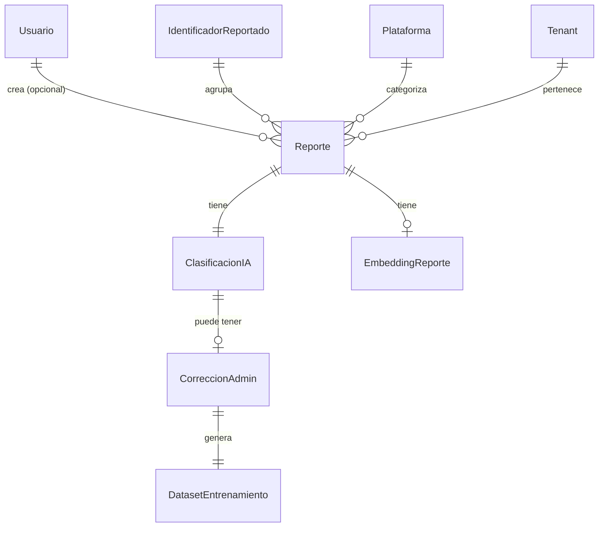

# Data Model: Módulo de Reportes Comunitarios

**Feature**: Módulo de Reportes Comunitarios (fase 2)  
**Date**: 2026-07-12  
**Depends on**: Fase 1 (autenticación, parámetros, multi-tenant)

---

## Entity Overview



---

## Enum Definitions

### `CategoriaConducta`
Categorías de conducta de riesgo detectadas por el modelo de IA.

| Value | Description |
|-------|-------------|
| `CONTACTO_INSISTENTE` | Contacto repetido e incómodo |
| `SOLICITUD_MATERIAL` | Solicitud de fotos/videos íntimos |
| `OFRECIMIENTO_REGALOS` | Ofrecimiento de dinero, regalos o beneficios |
| `SUPLANTACION_IDENTIDAD` | Fingir ser menor, familiar o figura de autoridad |
| `SOLICITUD_ENCUENTRO` | Solicitud de reunión física |
| `COMPARTIMIENTO_SEXUAL` | Envío o solicitud de contenido sexual |
| `OTRO` | Conducta real que no encaja en las categorías anteriores |

### `EstadoReporte`
Estados del ciclo de vida de un reporte.

| Value | Description |
|-------|-------------|
| `PENDIENTE` | Recién creado, esperando procesamiento |
| `PROCESANDO` | En cola de IA, clasificación en curso |
| `CLASIFICADO` | Clasificación automática completada |
| `REVISION_MANUAL` | Baja confianza del modelo, requiere admin |
| `POSIBLE_SPAM` | Texto incoherente o muy corto, requiere admin |
| `DUPLICADO` | Detectado como duplicado, vinculado a existente |
| `REQUIERE_ANONIMIZACION` | Contiene PII de menores, requiere anonimización por admin |
| `CORREGIDO` | Clasificación corregida por administrador |

---

## Entity: Reporte

Denuncia individual sobre un identificador de riesgo.

| Field | Type | Constraints | Description |
|-------|------|-------------|-------------|
| `id` | `String` (CUID) | PK | Identificador único |
| `identificador` | `String` | Not null, indexed | Número telefónico, nick o usuario reportado |
| `plataformaId` | `String` | FK → Plataforma | Plataforma donde ocurrió el incidente |
| `texto` | `String` (TEXT) | Not null, min 20 chars | Texto operativo (anonimizado si aplica) |
| `textoOriginal` | `String` (TEXT) | Nullable | Texto original con PII (acceso restringido, solo admin) |
| `fechaIncidente` | `DateTime` | Not null | Cuándo ocurrió el incidente |
| `ciudad` | `String` | Not null | Ciudad del incidente |
| `pais` | `String` | Not null | País del incidente |
| `estado` | `EstadoReporte` | Not null, default PENDIENTE | Estado del ciclo de vida |
| `esAnonimo` | `Boolean` | Not null, default true | true = usuario no autenticado |
| `usuarioId` | `String` | FK → Usuario, nullable | Vínculo al reportante (solo si autenticado) |
| `reporteOrigenId` | `String` | FK → Reporte, nullable | Si es duplicado, vínculo al reporte original |
| `numeroSeguimiento` | `String` | Unique, nullable | Código público para que el reportante consulte estado |
| `tenantId` | `String` | FK → Tenant, nullable | Multi-tenant (colegio asociado, si aplica) |
| `creadoEn` | `DateTime` | Not null, default now | Timestamp de creación |
| `actualizadoEn` | `DateTime` | Not null, auto-update | Timestamp de última modificación |

**Indexes**:
- `identificador` + `plataformaId` (para agregación)
- `estado` (para queries de cola de procesamiento)
- `usuarioId` + `identificador` (para deduplicación autenticada)
- `creadoEn` (para ordenamiento)

---

## Entity: IdentificadorReportado

Agregación de reportes por identificador único. Materializada para consultas rápidas.

| Field | Type | Constraints | Description |
|-------|------|-------------|-------------|
| `id` | `String` (CUID) | PK | Identificador único |
| `identificador` | `String` | Not null, unique per plataforma | Valor reportado |
| `plataformaId` | `String` | FK → Plataforma | Plataforma asociada |
| `totalReportes` | `Int` | Not null, default 0 | Conteo total de reportes independientes |
| `reportesAutenticados` | `Int` | Not null, default 0 | Conteo de reportes de usuarios autenticados |
| `reportesAnonimos` | `Int` | Not null, default 0 | Conteo de reportes anónimos |
| `esVisiblePublicamente` | `Boolean` | Not null, default false | true si supera umbral + ratio autenticados |
| `ultimoReporteEn` | `DateTime` | Nullable | Timestamp del último reporte recibido |
| `creadoEn` | `DateTime` | Not null, default now | Timestamp de creación |
| `actualizadoEn` | `DateTime` | Not null, auto-update | Timestamp de última modificación |

**Unique constraint**: `identificador` + `plataformaId`

**Indexes**:
- `esVisiblePublicamente` (para consultas públicas)
- `totalReportes` (para ordenamiento)

---

## Entity: Plataforma

Catálogo de plataformas donde pueden ocurrir incidentes.

| Field | Type | Constraints | Description |
|-------|------|-------------|-------------|
| `id` | `String` (CUID) | PK | Identificador único |
| `clave` | `String` | Not null, unique | Slug interno (whatsapp, instagram, tiktok, etc.) |
| `nombre` | `String` | Not null | Nombre legible para humanos |
| `categoria` | `String` | Not null | "mensajeria", "red_social", "juego", "otro" |
| `esActiva` | `Boolean` | Not null, default true | Si aparece en el selector de plataformas |
| `creadoEn` | `DateTime` | Not null, default now | Timestamp de creación |

**Seed inicial**:
- `whatsapp` → "WhatsApp" (mensajeria)
- `instagram` → "Instagram" (red_social)
- `tiktok` → "TikTok" (red_social)
- `facebook` → "Facebook" (red_social)
- `discord` → "Discord" (mensajeria)
- `roblox` → "Roblox" (juego)
- `minecraft` → "Minecraft" (juego)
- `telegram` → "Telegram" (mensajeria)
- `snapchat` → "Snapchat" (red_social)
- `otro` → "Otra plataforma" (otro)

---

## Entity: ClasificacionIA

Resultado del análisis automático de un reporte.

| Field | Type | Constraints | Description |
|-------|------|-------------|-------------|
| `id` | `String` (CUID) | PK | Identificador único |
| `reporteId` | `String` | FK → Reporte, unique | Reporte clasificado |
| `categoria` | `CategoriaConducta` | Not null | Categoría detectada por IA |
| `confianza` | `Float` | Not null, 0.0–1.0 | Nivel de confianza del modelo |
| `contienePii` | `Boolean` | Not null, default false | Si el texto contiene datos personales de menores |
| `piiDetectada` | `String[]` | Nullable | Fragmentos de texto identificados como PII |
| `modeloUsado` | `String` | Not null | Nombre del modelo (ej: "ornith:9b") |
| `latenciaMs` | `Int` | Not null | Tiempo de respuesta de Ollama en milisegundos |
| `promptTokens` | `Int` | Nullable | Tokens de entrada (si Ollama los reporta) |
| `responseTokens` | `Int` | Nullable | Tokens de salida (si Ollama los reporta) |
| `rawResponse` | `String` (TEXT) | Nullable | Respuesta cruda de Ollama (para debugging) |
| `creadoEn` | `DateTime` | Not null, default now | Timestamp de clasificación |

**Indexes**:
- `categoria` (para filtrado por admin)
- `confianza` (para identificar clasificaciones de baja confianza)

---

## Entity: CorreccionAdmin

Registro de una corrección manual aplicada por un administrador.

| Field | Type | Constraints | Description |
|-------|------|-------------|-------------|
| `id` | `String` (CUID) | PK | Identificador único |
| `clasificacionId` | `String` | FK → ClasificacionIA, unique | Clasificación corregida |
| `categoriaOriginal` | `CategoriaConducta` | Not null | Categoría antes de la corrección |
| `categoriaCorregida` | `CategoriaConducta` | Not null | Categoría después de la corrección |
| `adminId` | `String` | FK → Usuario | Administrador que aplicó la corrección |
| `motivo` | `String` (TEXT) | Nullable | Justificación de la corrección |
| `creadoEn` | `DateTime` | Not null, default now | Timestamp de la corrección |

**Business rule**: Al crear una CorreccionAdmin, el sistema automáticamente genera un registro en DatasetEntrenamiento.

---

## Entity: DatasetEntrenamiento

Par (texto, clasificación correcta) para reentrenar el modelo de IA.

| Field | Type | Constraints | Description |
|-------|------|-------------|-------------|
| `id` | `String` (CUID) | PK | Identificador único |
| `texto` | `String` (TEXT) | Not null | Texto del reporte (anonimizado) |
| `clasificacionCorrecta` | `CategoriaConducta` | Not null | Categoría correcta (de la corrección admin) |
| `fuente` | `String` | Not null | "correccion_admin" o "anotacion_manual" |
| `correccionId` | `String` | FK → CorreccionAdmin, nullable | Vínculo a la corrección que generó este registro |
| `usadoParaEntrenamiento` | `Boolean` | Not null, default false | Si ya fue usado en un ciclo de reentrenamiento |
| `creadoEn` | `DateTime` | Not null, default now | Timestamp de creación |

---

## Entity: EmbeddingReporte

Vector de embeddings del texto del reporte, para detección de duplicados anónimos.

| Field | Type | Constraints | Description |
|-------|------|-------------|-------------|
| `id` | `String` (CUID) | PK | Identificador único |
| `reporteId` | `String` | FK → Reporte, unique | Reporte asociado |
| `vector` | `Unsupported("vector(768)")` | Not null | Embedding de 768 dimensiones (pgvector) |
| `modeloUsado` | `String` | Not null | "nomic-embed-text" o similar |
| `creadoEn` | `DateTime` | Not null, default now | Timestamp de creación |

**Index**: `vector` con `hnsw` (pgvector) para búsqueda por similitud.

---

## State Transitions

```
PENDIENTE → PROCESANDO → CLASIFICADO
                        → REVISION_MANUAL (baja confianza)
                        → POSIBLE_SPAM (texto incoherente)
                        → REQUIERE_ANONIMIZACION (PII detectada)
PENDIENTE → DUPLICADO (detectado como duplicado)
REQUIERE_ANONIMIZACION → CLASIFICADO (admin anonimiza)
CLASIFICADO → CORREGIDO (admin corrige)
```

**Regla dura**: Un reporte en estado `REQUIERE_ANONIMIZACION` **NUNCA** cuenta para el umbral de visibilidad pública ni aparece en ninguna consulta hasta ser anonimizado. El campo `textoOriginal` solo es accesible para administradores y nunca se expone en APIs públicas ni alimenta el dataset de entrenamiento.

---

## Nuevos Parámetros de Sistema

| Clave | Valor Default | Tipo | Categoría | Público | Descripción |
|-------|--------------|------|-----------|---------|-------------|
| `reportes.classification_model` | `"ornith:9b"` | STRING | SECURITY | false | Modelo Ollama para clasificación de conductas |
| `reportes.embedding_model` | `"nomic-embed-text"` | STRING | SECURITY | false | Modelo Ollama para embeddings de similitud |
| `reportes.duplicate.similarity_threshold` | `"0.92"` | FLOAT | SECURITY | false | Umbral de similitud coseno para duplicados anónimos |
| `reportes.spam.min_text_length` | `"20"` | INTEGER | SECURITY | true | Longitud mínima de texto para no marcar como spam |
| `reportes.worker.max_retries` | `"3"` | INTEGER | SECURITY | false | Máximo de reintentos de procesamiento por job |
| `reportes.worker.stalled_threshold_minutes` | `"5"` | INTEGER | SECURITY | false | Minutos antes de alertar cola estancada |
| `visibility.min_authenticated_ratio` | `"0.5"` | FLOAT | VISIBILITY | true | Ratio mínimo de reportes autenticados para visibilidad pública |

---

## Multi-Tenant Notes

- `Reporte.tenantId` es nullable porque los reportes anónimos no tienen tenant asociado
- Los reportes de usuarios autenticados heredan el `tenantId` del colegio al que pertenece el usuario
- `IdentificadorReportado` no tiene `tenantId`; la agregación es global (todos los tenants contribuyen al conteo)
- La consulta pública no filtra por tenant; muestra datos agregados de todos